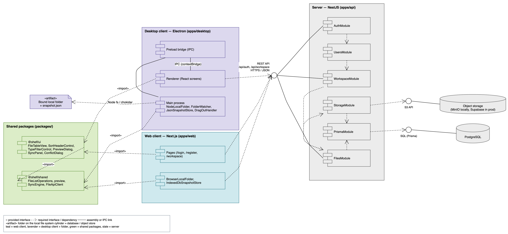
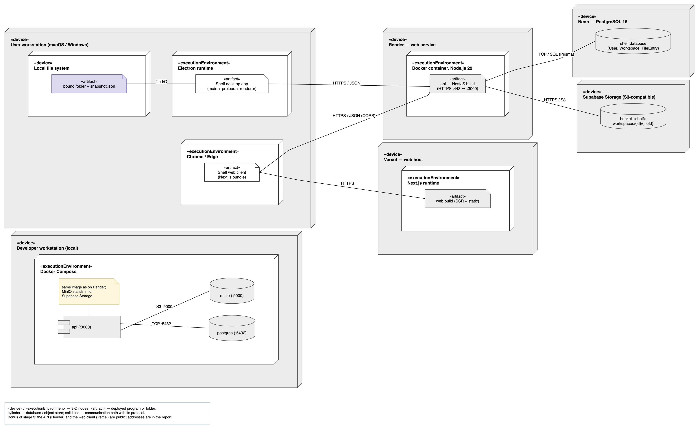
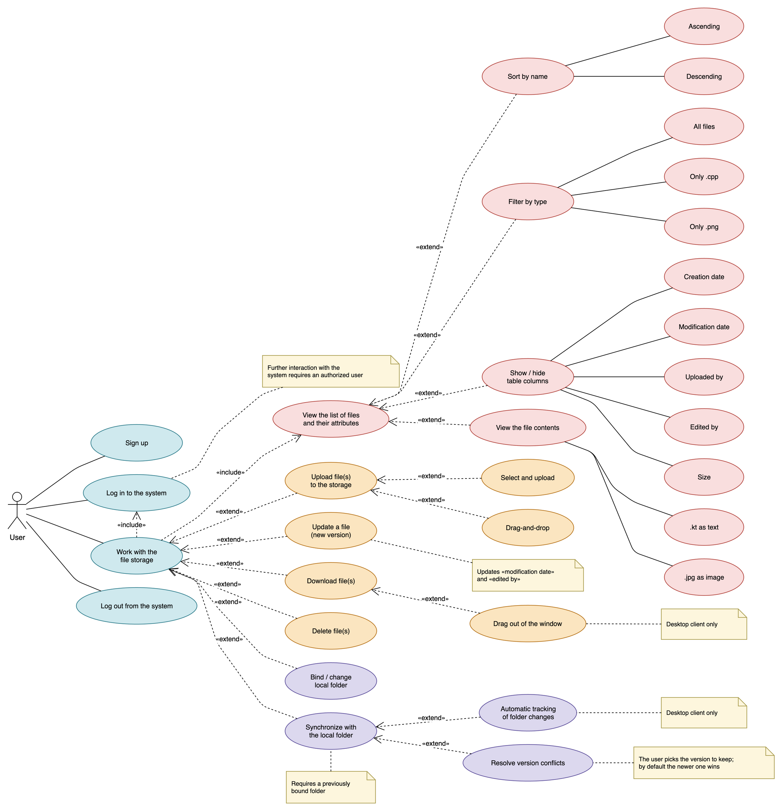
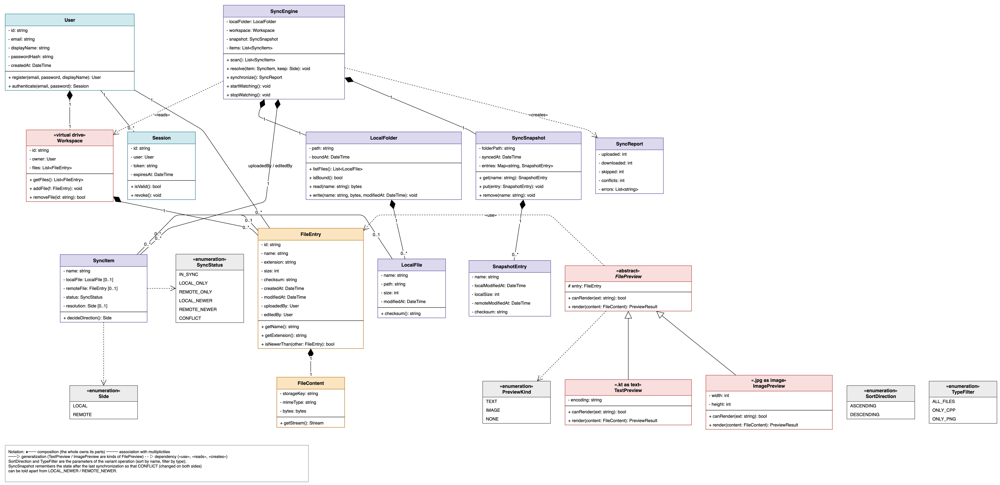
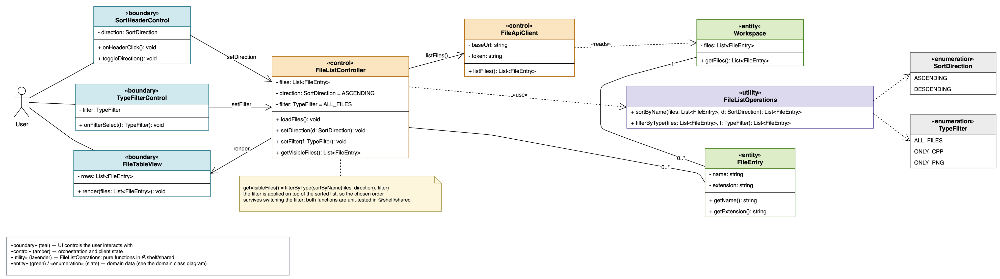
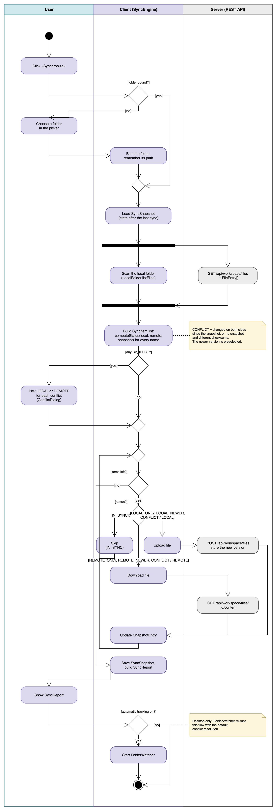
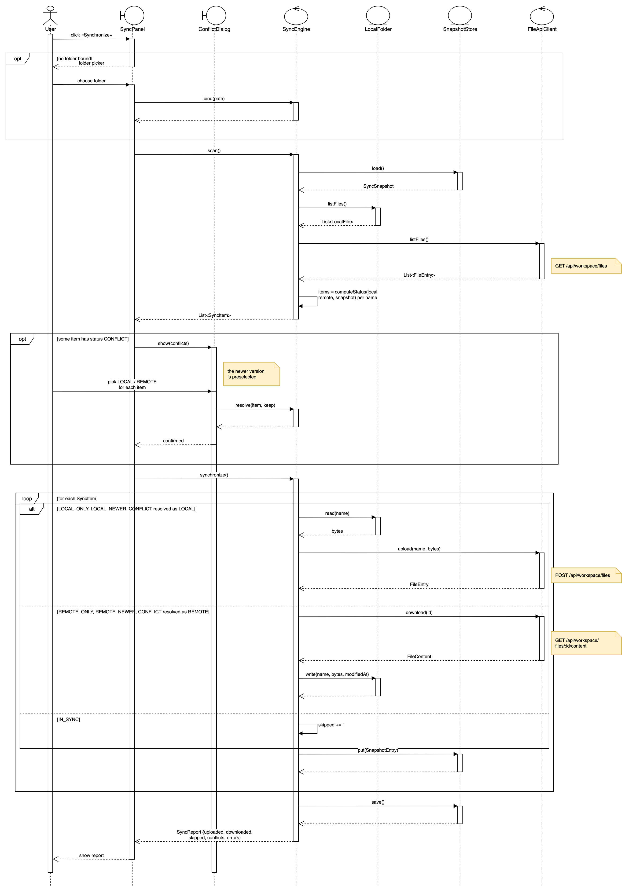
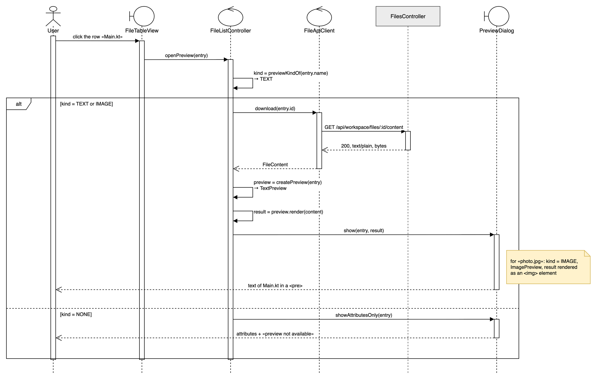
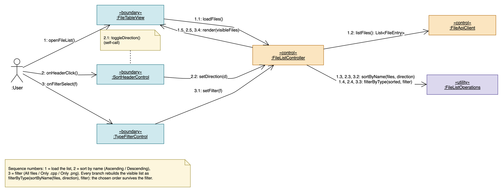
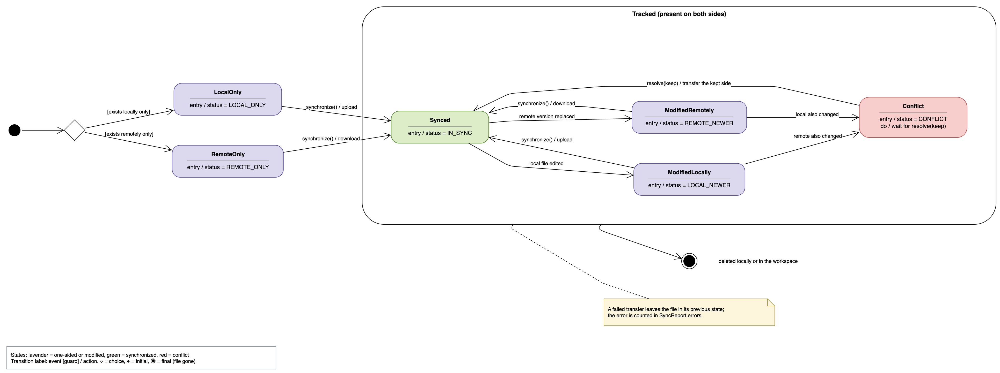

```{=latex}
\makeatletter
\let\ShelfTexttt\texttt
\renewcommand{\texttt}[1]{{\ShelfTexttt{\hyphenchar\font=-1\relax #1}}}
\makeatother
\setlength{\emergencystretch}{5em}
\hyphenation{
  Ascending AuthController AuthModule AuthResponseDto AuthService Automatic
  BrowserLocalFolder Compose ConflictDialog Creation Descending Docker
  DragOutHandler Electron FileApiClient FileContent FileEntry FileEntryDto
  FileListController FileListOperations FilePreview FileTableView FilesController FilesModule
  FilesService FolderWatcher ImagePreview IndexedDbSnapshotStore JsonSnapshotStore JwtAuthGuard
  JwtStrategy LocalFile LocalFolder LocalOnly LoginDto MinIO
  Modification ModifiedLocally ModifiedRemotely NestJS NodeLocalFolder PostgreSQL
  PreviewDialog PreviewKind PrismaModule PrismaService RegisterDto RemoteOnly
  ShelfTexttt SnapshotEntry SnapshotStore SortDirection SortHeaderControl Storage
  StorageModule StorageService Supabase SyncEngine SyncItem SyncPanel
  SyncReport SyncSnapshot SyncStatus Synchronize TextPreview TypeFilter
  TypeFilterControl UserDto UsersModule UsersService WorkspaceController WorkspaceModule
  WorkspaceService attributes available bounded canRender changes
  compatible computeStatus conflict conflicts container contextBridge
  createPreview editedBy executionEnvironment fileCount filterByType getVisibleFiles
  isValid listFiles loadFiles macOS mimeType modifiedAt
  onFilterSelect onHeaderClick openFileList openPreview preselected previewKindOf
  previously resolve runtime setDirection setFilter showAttributesOnly
  snapshot sortByName storageKey toggleDirection tracking transfer
  uploadedBy visibleFiles workspace}
```

# Постановка задачі

Робота виконується в межах курсу «Інформаційні технології» і полягає у створенні
системи **типу 2** — клієнта для взаємодії з віддаленою папкою з файлами, тобто
полегшеного аналога Google Drive. Робоча назва проєкту — **Shelf**. Система
складається з віддаленого сервера, який зберігає файли та їхні метадані, і двох
клієнтів — десктопного і веб-клієнта, — що працюють з тим самим сервером через
спільний REST API.

Загальні вимоги, однакові для всіх варіантів завдання:

- користувач реєструється і входить на віддаленому сервері; після входу він
  працює у власному просторі (віртуальному диску), вміст якого недоступний іншим
  користувачам;
- список файлів показується з атрибутами: назва, дата і час створення, дата і час
  зміни, хто завантажив, хто редагував;
- будь-який стовпець таблиці, крім назви, можна показати або приховати;
- підтримуються завантаження файлу на сервер, скачування і видалення;
- обрана локальна папка синхронізується з віддаленим простором.

Індивідуальну частину визначає варіант **8-6** — дві останні цифри номера
студентського квитка:

| Цифра | Список | Значення |
|:------|:-----------------|:---------------------------|
| 8 | ТИПИ файлів, вміст яких показується при кліку | `.kt` — як текст, `.jpg` — як зображення |
| 6 | ОПЕРАЦІЇ над списком файлів | сортування за назвою (зростання / спадання); фільтр «усі файли» / «лише `.cpp`» / «лише `.png`» |

Роботу поділено на чотири етапи:

| Етап | Зміст | Бали |
|:------|:------------------------------------------------|:------|
| 1 | UML-специфікація системи | 2 |
| 2 | Десктопна версія: unit-тести (не менше трьох, по одному на операцію варіанта), графічний інтерфейс, звіт | 13 |
| 3 | Веб-версія: графічний інтерфейс, звіт | 13 |
| 4 | Порівняльний аналіз десктопної та веб-версій | 2 |

Передбачено два бонусні завдання: drag-and-drop під час завантаження і
вивантаження файлів (+5 балів) та публікація серверної частини за публічною
адресою (+5 балів). Обидва заплановано до виконання, і обидва враховано в
специфікації: перше — окремими прецедентами, друге — вузлами діаграми розгортання.

**Нюанс варіанта.** Типи файлів для перегляду вмісту (`.kt`, `.jpg`) і типи для
фільтра (`.cpp`, `.png`) не збігаються, оскільки цифри варіанта незалежні. Щоб не
отримати двох неузгоджених списків розширень, перегляд реалізується узагальнено:
будь-який текстовий файл (`.kt`, `.cpp`, `.txt`, `.md`, `.json` та подібні)
показується як текст, а будь-яке растрове зображення (`.jpg`, `.jpeg`, `.png`,
`.gif`, `.webp`) — як картинка. Обов'язковими й покритими тестами випадками
залишаються саме `.kt` та `.jpg`; для решти типів відкривається вікно з атрибутами
файлу і поміткою «перегляд недоступний».

**Мета етапу 1** — побудувати UML-специфікацію, яка однозначно фіксує дійових
осіб, прецеденти, доменні поняття, архітектуру і сценарії роботи системи, щоб на
етапах 2 і 3 писати код за готовими іменами, а не вигадувати їх заново. Обов'язковий
мінімум для етапу — щонайменше одна діаграма прецедентів, дві діаграми класів, одна
діаграма активності, дві діаграми взаємодії, одна діаграма станів, одна діаграма
компонентів і одна діаграма розгортання. У цьому звіті наведено десять діаграм, тож
мінімум перевищено.

# Аналіз вимог

## Дійові особи

Єдина дійова особа системи — **User**, тобто користувач з обліковим записом на
сервері. Неавторизований відвідувач може виконати лише два прецеденти — реєстрацію
та вхід; решта функціональності доступна тільки після успішної автентифікації.
Окремої ролі адміністратора немає, бо кожен користувач бачить винятково власний
простір і не може впливати на чужі дані. База даних і об'єктне сховище — внутрішні
компоненти системи, а не зовнішні актори: вони не мають власної мети використання
і звертаються до них лише серверні модулі.

## Функціональні вимоги

| ID | Вимога | Прецеденти |
|:---|:------------------------------------------------------|:------------|
| R1 | Реєстрація та вхід на віддаленому сервері; після входу користувач працює у власному просторі (віртуальному диску) | UC1, UC2, UC3, UC15 |
| R2 | Перегляд файлів з атрибутами: назва, дата і час створення, дата і час зміни, хто завантажив, хто редагував (допоміжно — розмір і тип) | UC4 |
| R3 | Показ і приховування будь-якого стовпця таблиці, крім назви | UC7 |
| R4 | Сортування за назвою за зростанням і за спаданням (операція варіанта) | UC5 |
| R5 | Фільтр: усі файли, лише `.cpp`, лише `.png` (операція варіанта) | UC6 |
| R6 | Клік по файлу показує його вміст: `.kt` як текст, `.jpg` як зображення (тип варіанта) | UC8 |
| R7 | Завантаження файлу (нового або нової версії наявного), скачування, видалення | UC9, UC10, UC11, UC12 |
| R8 | Синхронізація обраної локальної папки з віддаленим простором; конфлікти версій виявляються і розв'язуються | UC13, UC14 |
| R9 | Бонус: drag-and-drop під час завантаження (обидва клієнти) і під час скачування (перетягування з вікна десктоп-клієнта) | UC9b, UC11a |

## Нефункціональні вимоги

- **Безпека.** Паролі зберігаються як bcrypt-хеші, сесія — це JWT (HS256, строк дії
  24 години), який клієнт передає в заголовку `Authorization: Bearer`. Кожен запит
  до простору перевіряє власника, тому користувач бачить лише свої файли.
- **Обмеження.** Розмір одного файлу — до 50 МБ, перевірка виконується і на
  клієнті, і на сервері. Простір плоский, без підпапок; ім'я файлу унікальне в
  межах простору, тому повторне завантаження того самого імені означає нову версію.
- **Переносимість.** Десктопний клієнт працює на macOS і Windows (Electron),
  веб-клієнт — у сучасних браузерах; синхронізація у вебі доступна в Chrome та Edge,
  бо потребує File System Access API.
- **Тестованість.** Сортування, фільтр, вибір способу перегляду і обчислення
  статусу синхронізації реалізовані як чисті функції у спільному пакеті, тому їх
  можна покрити unit-тестами без запущеного сервера.
- **Розгортання.** Серверна частина має однаково запускатися локально в Docker
  Compose і публікуватися на керованих сервісах без адміністрування власної
  віртуальної машини.

Поза обсягом роботи залишаються спільний доступ між користувачами, підпапки,
редагування тексту в застосунку, історія версій, квоти на обсяг і поширення
видалень під час синхронізації.

## Глосарій

| Ідентифікатор | Український термін |
|:--------------------------------|:-------------------------------------|
| Workspace | простір (віртуальний диск) користувача |
| FileEntry | запис про файл (метадані) |
| FileContent | вміст файлу (об'єкт у сховищі) |
| FilePreview, TextPreview, ImagePreview | перегляд вмісту; текстовий і графічний перегляд |
| LocalFolder, LocalFile | прив'язана локальна папка; локальний файл |
| SyncSnapshot | знімок стану після останньої синхронізації |
| SyncItem, SyncStatus, Side | елемент плану синхронізації; його статус; сторона (локальна або віддалена) |
| SyncEngine, SyncReport | рушій синхронізації; звіт про синхронізацію |
| SortDirection, TypeFilter | напрям сортування; фільтр за типом |
| FileListOperations | операції над списком файлів (сортування, фільтр) |

## Перелік прецедентів

| ID | Прецедент | Опис |
|:------|:--------------------------|:--------------------------------|
| UC1 | Sign up | Реєстрація нового облікового запису; система створює для нього порожній простір |
| UC2 | Log in to the system | Вхід за поштою і паролем; клієнт отримує JWT для подальших запитів |
| UC3 | Work with the file storage | Узагальнювальний прецедент роботи зі сховищем; включає вхід і перегляд списку |
| UC4 | View the list of files and their attributes | Таблиця файлів простору з усіма атрибутами |
| UC5 | Sort by name | Сортування списку за назвою за зростанням або спаданням (операція варіанта) |
| UC6 | Filter by type | Фільтр списку: усі файли, лише `.cpp`, лише `.png` (операція варіанта) |
| UC7 | Show / hide table columns | Перемикання видимості стовпців, крім назви |
| UC8 | View the file contents | Показ вмісту файлу: `.kt` як текст, `.jpg` як зображення (тип варіанта) |
| UC9 | Upload file(s) to the storage | Завантаження одного або кількох файлів; UC9a — вибір у діалозі, UC9b — drag-and-drop |
| UC10 | Update a file (new version) | Завантаження файлу з наявним іменем оновлює запис, дату зміни і поле «хто редагував» |
| UC11 | Download file(s) | Скачування файлів; UC11a — перетягування з вікна десктоп-клієнта |
| UC12 | Delete file(s) | Видалення файлів з простору разом з об'єктом у сховищі |
| UC13 | Bind / change local folder | Вибір локальної папки для синхронізації та зміна вже прив'язаної |
| UC14 | Synchronize with the local folder | Синхронізація прив'язаної папки з простором; UC14a — автоматичне відстеження змін, UC14b — розв'язання конфліктів версій |
| UC15 | Log out from the system | Вихід із системи і знищення сесії на клієнті |

Прецедентом варіанта для діаграми класів VOPC і діаграми комунікації обрано пару
UC5 і UC6 («Sort and filter the file list»), а прецедентом типу варіанта для
діаграми послідовності — UC8.

# Високорівневе проєктування

## Архітектура

Система реалізується як монорепозиторій на pnpm workspaces:

```
shelf/
  apps/api/          NestJS 11, Prisma, PostgreSQL, S3, JWT
  apps/desktop/      Electron + React + Vite
  apps/web/          Next.js (App Router)
  packages/shared/   @shelf/shared — типи і чисті функції
  packages/ui/       @shelf/ui — спільні React-компоненти
  docker/            compose: postgres, minio, api
  docs/specs/        специфікація дизайну
  docs/uml/          drawio/ (редаговані), img/ (svg + png)
  docs/reports/      звіти етапів (md у docx і pdf)
  tools/             збірка звітів
```

Обидва клієнти працюють з одним REST API і не мають власної бізнес-логіки.
Сортування, фільтр, видимість стовпців, вибір способу перегляду і побудова плану
синхронізації обчислюються **на клієнті**, у пакеті `@shelf/shared`; сервер
відповідає лише за автентифікацію, зберігання метаданих і байтів та за контрольні
суми. Завдяки цьому операції варіанта покриваються unit-тестами без мережі, а
десктопна і веб-версії поводяться однаково.

Серверна частина поділена на модулі NestJS:

| Модуль | Класи | Відповідальність |
|:-----------------|:--------------------------|:--------------------------|
| `AuthModule` | `AuthController`, `AuthService`, `JwtStrategy`, `JwtAuthGuard` | реєстрація, вхід, видача і перевірка JWT |
| `UsersModule` | `UsersService` | пошук і створення користувачів, bcrypt |
| `WorkspaceModule` | `WorkspaceController`, `WorkspaceService` | простір користувача, список файлів, метадані |
| `FilesModule` | `FilesController`, `FilesService` | завантаження, скачування, видалення, оновлення версії, контрольна сума |
| `StorageModule` | `StorageService` | запис, читання і видалення об'єктів через S3 API |
| `PrismaModule` | `PrismaService` | доступ до бази даних |

## REST API

Усі маршрути мають префікс `/api`, і всі, крім `auth/register` та `auth/login`,
вимагають заголовка `Authorization: Bearer <jwt>`. У таблиці префікс `/api`
опущено.

| Метод | Шлях | Тіло або параметри | Відповідь |
|:-----|:--------------------|:--------------|:---------------|
| POST | `auth/register` | `RegisterDto` | `AuthResponseDto` |
| POST | `auth/login` | `LoginDto` | `AuthResponseDto` |
| GET | `auth/me` | — | `UserDto` |
| GET | `workspace` | — | `id`, `owner`, `fileCount` |
| GET | `workspace/files` | — | масив `FileEntryDto` |
| POST | `workspace/files` | multipart `file` | `FileEntryDto`; 201 — новий, 200 — оновлено |
| GET | `workspace/files/:id` | — | `FileEntryDto` |
| GET | `workspace/files/:id/content` | — | байти, `Content-Type` |
| DELETE | `workspace/files/:id` | — | 204 |

Коди помилок: 400 — не пройдено валідацію, 401 — немає або протух JWT, 404 — файл
не належить цьому простору, 409 — пошту вже зайнято, 413 — перевищено обмеження
50 МБ. Документація Swagger доступна на `/api/docs` поза режимом production.

## Рис. 1. Діаграма компонентів

{width=16cm}

**Пояснення.** Діаграма поділяє систему на чотири підсистеми, окреслені рамками.
Спільні пакети `packages/` містять два компоненти: `@shelf/ui` з презентаційними
React-компонентами «FileTableView», «SortHeaderControl», «TypeFilterControl»,
«PreviewDialog», «SyncPanel» і «ConflictDialog» та `@shelf/shared` з
«FileListOperations», модулем перегляду, «SyncEngine» і «FileApiClient»; стрілка
«import» між ними показує, що вся логіка списку й синхронізації зосереджена в
одному місці. Десктопний клієнт складається з компонентів «Main process»
(«NodeLocalFolder», «FolderWatcher», «JsonSnapshotStore», «DragOutHandler»),
«Preload bridge (IPC)» і «Renderer (React screens)», з'єднаних лінією
«IPC (contextBridge)»; від main-процесу відходить зв'язок «Node fs / chokidar» до
артефакту «Bound local folder + snapshot.json». Веб-клієнт має компоненти
«Pages (/login, /register, /workspace)» і «BrowserLocalFolder,
IndexedDbSnapshotStore». Обидва клієнти імпортують спільні пакети і споживають
єдиний надаваний інтерфейс — кульку «REST API, /api/auth, /api/workspace,
HTTPS / JSON». Сервер містить модулі «AuthModule», «UsersModule»,
«WorkspaceModule», «FilesModule», «StorageModule» і «PrismaModule»; «StorageModule»
вимагає інтерфейс «S3 API» до об'єктного сховища, а «PrismaModule» — інтерфейс
«SQL (Prisma)» до PostgreSQL. Легенда внизу пояснює нотацію та кольори підсистем.

## Рис. 2. Діаграма розгортання

{width=16cm}

**Пояснення.** Вузли позначено стереотипами «device» і «executionEnvironment», а
розгорнуті програми — «artifact». Робоча станція користувача (macOS або Windows)
містить локальну файлову систему з артефактом «bound folder + snapshot.json»,
середовище «Electron runtime» з артефактом «Shelf desktop app (main + preload +
renderer)» і браузер «Chrome / Edge» з артефактом «Shelf web client (Next.js
bundle)»; зв'язок «file I/O» показує, що прямий доступ до прив'язаної папки має
лише десктопний застосунок. Десктоп звертається до сервера каналом «HTTPS / JSON»,
браузер — каналом «HTTPS / JSON (CORS)». Вузол «Render — web service» виконує
«Docker container, Node.js 22» з артефактом «api — NestJS build (HTTPS :443 у
:3000)». Від нього йдуть два шляхи: «TCP / SQL (Prisma)» до вузла «Neon —
PostgreSQL 16» з базою «shelf database (User, Workspace, FileEntry)» і «HTTPS / S3»
до вузла «Supabase Storage (S3-compatible)» з бакетом «shelf». Сторінки
веб-клієнта віддає «Vercel — web host» із середовищем «Next.js runtime». Окремо
показано робочу станцію розробника, де «Docker Compose» піднімає ті самі api
(:3000), postgres (:5432) і minio (:9000); примітка зазначає, що образ той самий,
що й на Render, а MinIO заміняє Supabase Storage. Публічні адреси API та
веб-клієнта — це бонус етапу 3.

# Деталізоване проєктування

## Рис. 3. Діаграма прецедентів

{width=16cm}

**Пояснення.** Прецеденти впорядковані каскадом: ліворуч «User», у центрі базові
прецеденти, праворуч їхні листки-уточнення. Група access (блакитна) містить
«Sign up», «Log in to the system», «Work with the file storage» і «Log out from the
system»; «Work with the file storage» пов'язаний відношенням «include» з «Log in to
the system» і «View the list of files and their attributes»: список показується
одразу після входу. Примітка нагадує, що взаємодія вимагає авторизованого користувача. Від перегляду списку відходять чотири розширення групи list: «Sort by
name» з листками «Ascending» і «Descending» та «Filter by type» з листками «All
files», «Only .cpp», «Only .png» — це операції варіанта; «Show / hide table columns»
з п'ятьма листками; «View the file contents» з листками «.kt as text» і
«.jpg as image» — типи варіанта. Група files (помаранчева) — «Upload file(s) to the
storage» з листками «Select and upload» і «Drag-and-drop», «Update a file (new
version)» з приміткою про оновлення «modification date» та «edited by», «Download
file(s)» з листком «Drag out of the window» і «Delete file(s)». Група sync
(фіолетова) — «Bind / change local folder» і «Synchronize with the local folder» з
приміткою «Requires a previously bound folder», розширеннями «Automatic tracking of
folder changes» і «Resolve version conflicts» (UC14b), біля якого примітка пояснює
вибір новішої версії. Примітки «Desktop client only» позначають
два прецеденти, відсутні у вебі.

## Рис. 4. Діаграма класів: доменна модель

{width=16cm}

**Пояснення.** Модель охоплює три групи класів. Облік і зберігання: «User» з
операціями `register` і `authenticate`, «Session» з токеном і `isValid()`,
«Workspace» зі стереотипом «virtual drive» — простір користувача, «FileEntry» —
рядок метаданих файлу з `checksum`, датами та посиланнями `uploadedBy` і `editedBy`
на «User», і «FileContent» — самі байти з `storageKey` та `mimeType`. «Workspace»
пов'язаний з «FileEntry» композицією (зафарбований ромб), бо запис про файл не має
сенсу поза простором і зникає разом із ним; так само «FileEntry» композиційно
володіє своїм «FileContent». Перегляд вмісту: абстрактний «FilePreview» з
операціями `canRender(ext)` і `render(content)` та два спадкоємці — «TextPreview»
(«.kt as text») та «ImagePreview» («.jpg as image»). Синхронізація: «LocalFolder» і
«LocalFile» описують прив'язану папку, «SyncEngine» володіє списком «SyncItem»,
читає «Workspace» і створює «SyncReport», а «SyncSnapshot» із вкладеними
«SnapshotEntry» зберігає стан після останньої успішної синхронізації — саме він
дозволяє відрізнити `CONFLICT`, тобто зміну з обох боків, від `LOCAL_NEWER` чи
`REMOTE_NEWER`. Переліки «SyncStatus», «Side», «PreviewKind», «SortDirection» і
«TypeFilter» показані окремими блоками зі стереотипом «enumeration». Легенда внизу
пояснює нотацію композиції, узагальнення та залежностей.

## Рис. 5. Діаграма класів VOPC: сортування і фільтр

{width=16cm}

**Пояснення.** Діаграма показує лише класи, потрібні для прецедентів «Sort by name»
і «Filter by type», і розділяє їх за стереотипами. Межові класи («boundary»,
бірюзові) — «SortHeaderControl» з атрибутом `direction` та операціями
`onHeaderClick()` і `toggleDirection()`, «TypeFilterControl» з `filter` і
`onFilterSelect(f)`, «FileTableView» з `rows` і `render(files)`; саме з ними
безпосередньо взаємодіє дійова особа «User». Керувальні класи («control»,
бурштинові) — «FileListController», який тримає стан списку (`files`,
`direction = ASCENDING`, `filter = ALL_FILES`) і надає `loadFiles()`,
`setDirection(d)`, `setFilter(f)`, `getVisibleFiles()`, та «FileApiClient», що
читає дані сервера викликом `listFiles()`. Службовий клас («utility», лавандовий)
«FileListOperations» містить дві чисті функції — `sortByName` і `filterByType`.
Сутності («entity», зелені) «Workspace» і «FileEntry» та переліки «SortDirection» і
«TypeFilter» узяті з доменної моделі. Примітка фіксує інваріант: `getVisibleFiles()`
дорівнює `filterByType(sortByName(files, direction), filter)`, тобто фільтр
застосовується поверх уже відсортованого списку, тому обраний порядок не губиться
при перемиканні фільтра. «FileListOperations» не має стану і не залежить від мережі,
тому саме на нього пишуться обов'язкові unit-тести етапу 2.

## Рис. 6. Діаграма активності: синхронізація

{height=22.5cm}

**Пояснення.** Діаграма має три доріжки: «User», «Client (SyncEngine)» і «Server
(REST API)». Після дії «Click «Synchronize»» перевіряється передумова
[folder bound?]: якщо папки немає, користувач обирає її в діалозі, і клієнт виконує
«Bind the folder, remember its path»; інакше гілки одразу зливаються. Далі
завантажується «SyncSnapshot». Розгалуження (чорна смуга) запускає паралельно дві
дії — «Scan the local folder (LocalFolder.listFiles)» у доріжці клієнта і
«GET /api/workspace/files» у доріжці сервера; вузол злиття чекає обидві, після чого
для кожного імені обчислюється `computeStatus(local, remote, snapshot)` і будується
список «SyncItem». Примітка пояснює, що `CONFLICT` означає зміни з обох боків або
відсутність знімка при різних контрольних сумах і що новішу версію позначено
наперед. Якщо конфлікти є, керування переходить у доріжку користувача — «Pick LOCAL
or REMOTE for each conflict (ConflictDialog)». Далі цикл [items left?] обходить
елементи плану з розгалуженням [status?]: `IN_SYNC` — «Skip»; `LOCAL_ONLY`,
`LOCAL_NEWER`, `CONFLICT / LOCAL` — «Upload file» і `POST /api/workspace/files`;
`REMOTE_ONLY`, `REMOTE_NEWER`, `CONFLICT / REMOTE` — «Download file» і
`GET /api/workspace/files/:id/content`. Після кожного перенесення виконується
«Update SnapshotEntry». Коли елементи вичерпано, знімок зберігається, будується і
показується «SyncReport». Остання перевірка [automatic tracking on?] за потреби
запускає «FolderWatcher»; примітка зазначає, що спостерігач повторює цей самий потік
із розв'язанням конфліктів за замовчуванням.

## Рис. 7. Діаграма послідовності: синхронізація

{width=15cm}

**Пояснення.** Той самий сценарій показано як обмін повідомленнями між сімома
лініями життя: «User», «SyncPanel», «ConflictDialog», «SyncEngine», «LocalFolder»,
«SnapshotStore» і «FileApiClient». Після повідомлення «click «Synchronize»»
фрагмент `opt [no folder bound]` містить показ діалогу вибору папки, відповідь
користувача і `bind(path)`. Далі «SyncPanel» викликає `scan()`, усередині якого
«SyncEngine» читає знімок повідомленням `load()` до «SnapshotStore», отримує
`List<LocalFile>` від `LocalFolder.listFiles()` і `List<FileEntry>` від
`FileApiClient.listFiles()` (примітка вказує маршрут `GET /api/workspace/files`), а
потім у самовиклику обчислює `computeStatus` для кожного імені й повертає
`List<SyncItem>`. Фрагмент `opt [some item has status CONFLICT]` показує
`show(conflicts)`, вибір користувача та `resolve(item, keep)`; примітка нагадує, що
новішу версію позначено наперед. Виклик `synchronize()` розгортається у фрагмент
`loop [for each SyncItem]` з вкладеним `alt` за трьома групами статусів: `read(name)`
і `upload(name, bytes)` через `POST`; `download(id)` через `GET` і запис
`write(name, bytes, modifiedAt)`; лічильник `skipped += 1` для `IN_SYNC`.
«SnapshotStore» читається один раз на початку повідомленням `load()`, а
записується двічі: `put(SnapshotEntry)` після кожного успішного перенесення в
циклі і `save()` після його завершення. Наприкінці «SyncEngine» повертає
`SyncReport {uploaded, downloaded, skipped, conflicts, errors}`, який «SyncPanel»
показує користувачу.

## Рис. 8. Діаграма послідовності: перегляд вмісту файлу

{width=16cm}

**Пояснення.** Сценарій починається повідомленням «click the row «Main.kt»» від
«User» до «FileTableView», яка викликає `openPreview(entry)` у «FileListController».
Самовиклик `kind = previewKindOf(entry.name)` повертає `TEXT`: саме ця чиста функція
визначає спосіб перегляду за розширенням імені, не звертаючись ні до сервера, ні до
вмісту. Далі йде фрагмент `alt` з двома гілками. У гілці `[kind = TEXT or IMAGE]`
контролер просить `FileApiClient.download(entry.id)`; клієнт виконує
`GET /api/workspace/files/:id/content` до «FilesController» на сервері, отримує
відповідь «200, text/plain, bytes» і повертає «FileContent». Потім самовиклик
`preview = createPreview(entry)` створює «TextPreview», а `result =
preview.render(content)` формує результат, який передається у «PreviewDialog»
повідомленням `show(entry, result)`; користувач бачить текст «Main.kt» у елементі
`<pre>`. Примітка описує симетричний випадок: для «photo.jpg» `previewKindOf` дає
`IMAGE`, створюється «ImagePreview», а результат виводиться як елемент ``.
Гілка `[kind = NONE]` відповідає решті типів: «PreviewDialog» отримує
`showAttributesOnly(entry)` і показує лише атрибути з позначкою «preview not
available». Так одна діаграма покриває обидва обов'язкові типи варіанта і випадок,
коли перегляд недоступний.

## Рис. 9. Діаграма комунікації: сортування і фільтр

{width=16cm}

**Пояснення.** Діаграма комунікації показує ті самі об'єкти, що й діаграма класів
VOPC, але наголошує не на структурі, а на зв'язках і нумерації повідомлень. Перша
послідовність — початкове завантаження списку: `1: openFileList()` від `:User` до
`:FileTableView`, `1.1: loadFiles()` до `:FileListController`,
`1.2: listFiles(): List<FileEntry>` до `:FileApiClient`, далі
`1.3: sortByName(files, direction)` і `1.4: filterByType(sorted, filter)` до
`:FileListOperations` і `1.5: render(visibleFiles)` назад у `:FileTableView`. Друга
послідовність починається з `2: onHeaderClick()` до `:SortHeaderControl`; примітка
позначає самовиклик `2.1: toggleDirection()`, після якого йде
`2.2: setDirection(d)`. Третя — `3: onFilterSelect(f)` до `:TypeFilterControl` і
`3.1: setFilter(f)`. Ключова деталь нотації: завершальний ланцюжок 1.3–1.5 не
дублюється для другої та третьої послідовностей, а перевикористовується, тому
підписи на зв'язках із `:FileListOperations` і `:FileTableView` мають потрійну
нумерацію «1.3, 2.3, 3.2», «1.4, 2.4, 3.3» і «1.5, 2.5, 3.4». Це прямо показує, що
і завантаження списку, і зміна напряму сортування, і зміна фільтра перебудовують
видимий список тим самим виразом, а отже обраний порядок переживає перемикання
фільтра.

## Рис. 10. Діаграма станів файлу

{width=16cm}

**Пояснення.** Діаграма описує життєвий цикл одного імені файлу під час
синхронізації. З початкового псевдостану керування переходить у вузол вибору з
двома охоронними умовами: `[exists locally only]` веде у стан «LocalOnly» з дією
входу `entry / status = LOCAL_ONLY`, а `[exists remotely only]` — у «RemoteOnly» зі
статусом `REMOTE_ONLY`. Переходи `synchronize() / upload` з «LocalOnly» і
`synchronize() / download` з «RemoteOnly» переводять файл у композитний стан
`Tracked (present on both sides)`, який об'єднує чотири підстани: «Synced»
(`IN_SYNC`), «ModifiedLocally» (`LOCAL_NEWER`), «ModifiedRemotely» (`REMOTE_NEWER`)
і «Conflict» (`entry / status = CONFLICT`, `do / wait for resolve(keep)`). Події
«local file edited» і «remote version replaced» виводять зі «Synced» у відповідний
однобічний стан, а наступна синхронізація з вивантаженням або завантаженням
повертає назад. У «Conflict» система потрапляє лише двома шляхами — з
«ModifiedLocally» за подією «remote also changed» і з «ModifiedRemotely» за подією
«local also changed», тобто тільки тоді, коли змінилися обидві сторони; вихід із
нього один — `resolve(keep) / transfer the kept side` назад у «Synced». Перехід
«deleted locally or in the workspace» виводить файл із композитного стану у
кінцевий стан. Примітка зазначає, що невдалий перенос залишає файл у попередньому
стані, а помилка потрапляє в `SyncReport.errors`.

# Інструменти

Діаграми створено в редакторі draw.io: у репозиторії зберігаються редаговані файли
`.drawio` (тека `docs/uml/drawio/`), з яких через консольний інтерфейс draw.io
експортуються `.svg` і `.png` у теку `docs/uml/img/`. Векторний `.svg` призначений
для версії звіту у Word, растровий `.png` — для версії PDF. Текст звіту написано у
форматі Markdown і зібрано конвертером pandoc: DOCX формується прямою конвертацією,
а PDF — через рушій xelatex зі шрифтом Times New Roman 12 пт, полями 2 см,
автоматичним змістом, наскрізною нумерацією розділів і підписів «Рисунок N».
Титульну сторінку задає окремий шаблон `tools/titlepage.tex`, а всю збірку виконує
скрипт `tools/build-report.sh`.

# Висновки

На етапі 1 побудовано UML-специфікацію системи Shelf, яка фіксує для наступних
етапів усе, що не повинно змінюватися: імена класів, модулів і маршрутів REST API,
склад атрибутів файлу, правила обчислення статусу синхронізації та розв'язання
конфліктів, а також рішення виконувати сортування, фільтр, вибір способу перегляду
і побудову плану синхронізації на клієнті, у спільному пакеті `@shelf/shared`. Це
дозволяє покрити операції варіанта unit-тестами без сервера і повторно використати
ту саму логіку в десктопній та веб-версіях. Відкритими залишаються рішення щодо
конкретних постачальників хостингу: Render, Neon, Supabase Storage і Vercel обрано
попередньо, і на етапі 3 їх може бути замінено, якщо зміняться умови безкоштовних
планів; тоді оновиться діаграма розгортання. Обов'язковий мінімум діаграм
перевищено: підготовлено десять діаграм — одна прецедентів, дві класів, одна
активності, три взаємодії, одна станів, одна компонентів і одна розгортання.
