```{=latex}
\makeatletter
\let\ShelfTexttt\texttt
\renewcommand{\texttt}[1]{{\ShelfTexttt{\hyphenchar\font=-1\fontdimen3\font=0pt\fontdimen4\font=0pt\relax #1}}}
\makeatother
\setlength{\emergencystretch}{5em}
\hyphenation{
  Ascending AuthController AuthModule AuthResponseDto AuthService Automatic
  BrowserLocalFolder Compose ConflictDialog Creation Descending Docker
  DragOutHandler Electron FileApiClient FileContent FileEntry FileEntryDto
  FileListController FileListOperations FilePreview FileTableView FilesController FilesModule
  FilesService FolderWatcher ImagePreview IndexedDbSnapshotStore JsonSnapshotStore JwtAuthGuard
  JwtStrategy LocalFile LocalFolder LocalOnly LoginDto MinIO
  Modification ModifiedLocally ModifiedRemotely NestJS NodeLocalFolder PostgreSQL
  PreviewDialog PreviewKind PrismaModule PrismaService RegisterDto RemoteOnly
  ShelfTexttt SnapshotEntry SnapshotStore SortDirection SortHeaderControl Storage
  StorageModule StorageService Supabase SyncEngine SyncItem SyncPanel
  SyncReport SyncSnapshot SyncStatus Synchronize TextPreview TypeFilter
  TypeFilterControl UserDto UsersModule UsersService WorkspaceController WorkspaceModule
  WorkspaceService attributes available bounded canRender changes
  compatible computeStatus conflict conflicts container contextBridge
  createPreview editedBy executionEnvironment fileCount filterByType getVisibleFiles
  isValid listFiles loadFiles macOS mimeType modifiedAt
  onFilterSelect onHeaderClick openFileList openPreview preselected previewKindOf
  previously resolve runtime setDirection setFilter showAttributesOnly
  snapshot sortByName storageKey toggleDirection tracking transfer
  uploadedBy visibleFiles workspace
  useFileListController useDesktopSync SettingsStore FileTransfers SyncService
  registerIpc ShelfBridge UploadDropzone SidebarSection}
\floatplacement{figure}{htb}
\renewcommand{\topfraction}{0.9}
\renewcommand{\bottomfraction}{0.9}
\renewcommand{\textfraction}{0.07}
\setcounter{totalnumber}{3}
\widowpenalty=10000
\clubpenalty=10000
```


# Постановка задачі

Другий етап лабораторної роботи з курсу «Інформаційні технології» — десктопна
версія клієнта системи **типу 2**, тобто програми для роботи з віддаленою папкою з
файлами на зразок спрощеного Google Drive. Потрібно створити застосунок із
графічним інтерфейсом, написати unit-тести (не менше трьох, по одному на кожну
операцію варіанта) і скласти звіт. Разом із клієнтом розроблено сервер Shelf, з
яким клієнт обмінюється даними через REST API; веб-клієнт етапу 3 працюватиме з
тим самим сервером. Індивідуальну частину задає варіант **8-6**:

```{=latex}
\begingroup\small
```

| Цифра | Список | Значення |
|:------|:-----------------|:---------------------------|
| 8 | ТИПИ файлів, вміст яких показується при кліку | `.kt` — як текст, `.jpg` — як зображення |
| 6 | ОПЕРАЦІЇ | сортування за назвою (зростання / спадання); фільтр «усі файли» / «лише `.cpp`» / «лише `.png`» |

```{=latex}
\endgroup
```

Бонус drag-and-drop виконано в обох напрямках: файли з Finder або Провідника
можна кинути на таблицю, щоб вивантажити їх на сервер, а рядок таблиці —
витягнути з вікна, і там, де його відпустили, з'явиться копія файлу.

Реалізація відповідає UML-специфікації етапу 1 і документу дизайну — єдиному
джерелу імен: класи з діаграми VOPC мають у коді ті самі назви, ланцюжок
повідомлень з діаграми комунікації відтворено викликами функцій, а правила
статусів синхронізації записано як чисту функцію `computeStatus`. Уточнення,
зроблені під час програмування, зібрано в підрозділі 2.4.

# Архітектура реалізації

## Структура репозиторію

Код зберігається в одному монорепозиторії на pnpm workspaces. Спільні пакети
підключаються до застосунків як локальні залежності; каталог `apps/web` для
веб-версії з'явиться на етапі 3.

```
shelf/
  apps/api/          сервер: NestJS 11, Prisma, PostgreSQL, S3
  apps/desktop/      десктоп-клієнт: Electron, React, Vite
  packages/shared/   @shelf/shared: типи, операції, SyncEngine
  packages/ui/       @shelf/ui: React-компоненти клієнтів
  docker/            compose: postgres, minio, api
```

```{=latex}
\begingroup\small
```

| Пакет | Роль | Технології |
|:----------------|:---------------------------------------|:--------------------------------|
| `@shelf/api` | REST-сервер: облікові записи, метадані, вміст файлів | NestJS 11, Prisma 6, PostgreSQL 16, S3, JWT, Jest |
| `@shelf/desktop` | десктоп-клієнт і синхронізація з папкою | Electron 39, React 19, chokidar, electron-builder, Vitest |
| `@shelf/shared` | типи, операції варіанта, перегляд, REST-клієнт, `SyncEngine` | TypeScript, Vitest; збірка ESM і CommonJS |
| `@shelf/ui` | спільні компоненти й хук `useFileListController` | React 19, Tailwind CSS 4, lucide-react |
| `docker` | локальний стек | Docker Compose: PostgreSQL, MinIO, API |

```{=latex}
\endgroup
```

## Відповідність класів UML і коду

Таблиця зіставляє класи з діаграм етапу 1 з файлами коду; шлях указано відносно
каталогу `src/` пакета. Новий клас, якого немає на діаграмах, — `SyncService` у
main-процесі: він тримає план між скануванням і виконанням, керує `FolderWatcher`
і не допускає двох синхронізацій одночасно.

```{=latex}
\begingroup\footnotesize
```

| Клас з діаграм етапу 1 | Реалізація | Пакет | Файл |
|:-------------------|:-----------------------|:--------------|:--------------------------|
| `SortHeaderControl` | заголовок стовпця «Назва» | `@shelf/ui` | `SortHeaderControl.tsx` |
| `TypeFilterControl` | три кнопки фільтра | `@shelf/ui` | `TypeFilterControl.tsx` |
| `FileTableView` | таблиця файлів | `@shelf/ui` | `FileTableView.tsx` |
| `FileListController` | хук `useFileListController` | `@shelf/ui` | `useFileListController.ts` |
| `FileApiClient` | REST-клієнт | `@shelf/shared` | `fileApiClient.ts` |
| `FileListOperations` | `sortByName`, `filterByType`, `getVisibleFiles` | `@shelf/shared` | `fileListOperations.ts` |
| `FilePreview`, `TextPreview`, `ImagePreview` | класи, `previewKindOf`, `createPreview` | `@shelf/shared` | `preview.ts` |
| `PreviewDialog` | модальне вікно перегляду | `@shelf/ui` | `PreviewDialog.tsx` |
| `SyncEngine` | рушій синхронізації | `@shelf/shared` | `sync/syncEngine.ts` |
| `SyncItem` | тип, `computeStatus`, `decideDirection` | `@shelf/shared` | `sync/syncPlanner.ts` |
| `SyncSnapshot`, `SnapshotEntry` | знімок, інтерфейс `SnapshotStore` | `@shelf/shared` | `sync/snapshot.ts` |
| `SnapshotStore` | `JsonSnapshotStore` | `@shelf/desktop` | `main/jsonSnapshotStore.ts` |
| `LocalFolder` | інтерфейс, `MemoryLocalFolder` | `@shelf/shared` | `sync/localFolder.ts` |
| `LocalFolder` | `NodeLocalFolder` на Node `fs` | `@shelf/desktop` | `main/nodeLocalFolder.ts` |
| `SyncPanel`, `SyncReport` | блок синхронізації, `SyncReportView` | `@shelf/ui` | `SyncPanel.tsx` |
| `ConflictDialog` | діалог вибору версії | `@shelf/ui` | `ConflictDialog.tsx` |
| `FolderWatcher` | спостерігач на `chokidar` | `@shelf/desktop` | `main/folderWatcher.ts` |
| `DragOutHandler` | `FileTransfers` | `@shelf/desktop` | `main/fileTransfers.ts` |

```{=latex}
\endgroup
```

## Процеси десктоп-клієнта

Поділ Electron на процеси збігається з межами відповідальності. **Main-процес**
(`src/main`) має доступ до файлової системи, тож у ньому працюють `SettingsStore`,
`NodeLocalFolder`, `JsonSnapshotStore`, `FolderWatcher`, `SyncService` і
`FileTransfers`, а `registerIpc` оголошує обробники запитів. **Renderer-процес**
(`src/renderer`) — сторінка React з екранами `LoginScreen` і `WorkspaceScreen`,
ізольована від Node (`contextIsolation`, `sandbox`); список, вивантаження,
перегляд і видалення вона виконує сама через `FileApiClient`. **Preload-скрипт**
(`src/preload`) дає їй типізований міст `window.shelf` (`ShelfBridge`): кожен
метод — це `ipcRenderer.invoke`, а прогрес синхронізації надходить подіями IPC.

Сортування, фільтр і план синхронізації обчислюються на клієнті. Сервер віддає
простий список, а клієнт упорядковує й фільтрує його в пам'яті, тому перемикання
спрацьовує миттєво. Ці чисті функції в `@shelf/shared` перевіряються unit-тестами
без сервера і без змін підійдуть веб-клієнту. План синхронізації сервер скласти й
не може: для нього потрібні локальна папка і знімок стану.

## Уточнення порівняно з UML етапу 1

- `decideDirection(item)` — функція планувальника в `syncPlanner.ts`, а не метод
  `SyncItem`: елемент плану лишився простим записом даних, що проходить через IPC.
- Спостереження за папкою винесено з `SyncEngine` у десктопні `SyncService` і
  `FolderWatcher`, тож рушій не залежить від платформи й підійде для веба.
- `SnapshotEntry.remoteId` прив'язує запис знімка до `id` серверного файлу. Запис
  про інший файл під тим самим ім'ям (інший обліковий запис, скинутий сервер) не
  враховується, і файли порівнюються за контрольною сумою.
- Віддалена зміна визначається також за `checksum`, тож нову версію, вивантажену в
  межах допуску часу 2 с, теж помічено.
- План, складений викликом `scan()`, перед перенесенням перевіряється ще раз;
  файл, змінений після перевірки, пропускається з повідомленням у звіті.
- Імена, що відрізняються лише регістром або формою Unicode (`Main.kt` і
  `main.kt`), на macOS і Windows позначають один файл, тому пропускаються з
  повідомленням у звіті.
- `resolve(name, keep)` приймає назву файлу, а не `SyncItem`: назва є ключем плану
  і легко передається між процесами.
- До REST API додано `GET /api/health` для перевірки стану контейнера сервера.

# Сервер

## Модулі

Сервер — застосунок NestJS 11 з префіксом `/api`. `AuthModule` (`AuthController`,
`AuthService`, `JwtStrategy`, `JwtAuthGuard`) реєструє користувачів і видає JWT на
24 години; `UsersModule` створює користувачів разом з просторами;
`WorkspaceModule` визначає простір поточного користувача; `FilesModule` відповідає
за вивантаження, нові версії, скачування й видалення; `StorageModule` працює з
бакетом через S3 API; `PrismaModule` дає доступ до бази. Є також `ConfigModule`
для перевірки змінних середовища і `HealthController`. Тіла запитів перевіряє
`class-validator`, а повідомлення про помилки сервер повертає українською.

## REST API

Усі шляхи мають префікс `/api`; токен `Authorization: Bearer` потрібен скрізь,
крім реєстрації, входу і перевірки стану.

```{=latex}
\begingroup\small
```

| Метод | Шлях | Тіло / параметри | Відповідь |
|:-------|:--------------------------------|:---------------|:------------------------|
| POST | `/auth/register` | `RegisterDto` | `AuthResponseDto` |
| POST | `/auth/login` | `LoginDto` | `AuthResponseDto` |
| GET | `/auth/me` | — | `UserDto` |
| GET | `/workspace` | — | `WorkspaceDto` (`id`, `owner`, `fileCount`) |
| GET | `/workspace/files` | — | `FileEntryDto[]` |
| POST | `/workspace/files` | `multipart`, поле `file` | `FileEntryDto`; 201 — новий файл, 200 — нова версія |
| GET | `/workspace/files/:id` | — | `FileEntryDto` |
| GET | `/workspace/files/:id/content` | — | вміст файлу з типом і назвою в заголовках |
| DELETE | `/workspace/files/:id` | — | 204 |
| GET | `/health` | — | `{status: "ok"}` |

```{=latex}
\endgroup
```

Коди помилок: 400 — некоректне тіло або назва файлу, 401 — немає чи прострочений
токен, 404 — файлу немає в просторі користувача, 409 — адресу пошти вже зареєстровано,
413 — файл більший за 50 МБ. Файл чужого простору і некоректний `id` дають ту саму
відповідь 404, що й неіснуючий файл.

## Документація API

За адресою `/api/docs` сервер показує Swagger UI з описом API у форматі OpenAPI
(на публічному сервері сторінку можна вимкнути змінною середовища). На рис. 1 видно
всі маршрути, згруповані за контролерами `health`, `auth`, `workspace` і `files`;
замок біля маршруту означає, що потрібен токен, а кнопка «Authorize» дає змогу
вставити JWT і викликати захищені маршрути з браузера. Унизу наведено схеми
`RegisterBody` і `LoginBody`, за якими перевіряються реєстрація та вхід. Сторінка
дає змогу перевірити вимоги R1 і R7 на рівні сервера без клієнта.

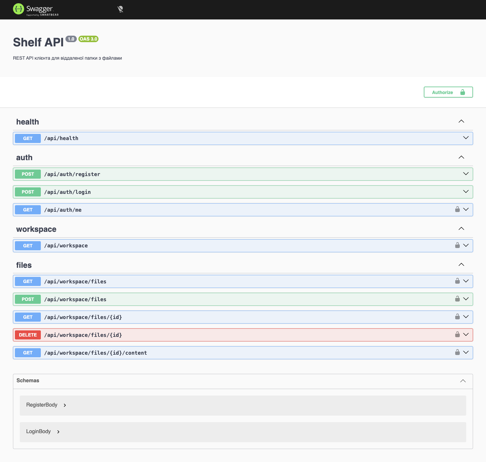{width=11cm}

## Нова версія файлу (UC10)

Вивантаження файлу з назвою, яка вже є в просторі, створює нову версію.
`FilesService.upsert` шукає запис за унікальною парою «простір, назва». Лишаються
той самий `FileEntry` з його `id`, датою створення, автором і ключем у сховищі, а
змінюються байти, `size`, `checksum` (SHA-256, рахує сервер), `modifiedAt`
(поточний час) і `editedBy` — поточний користувач, тобто власник простору;
відповідь має код 200 замість 201. Назва зберігається точно такою, якою її
надіслав клієнт, без обрізання пробілів і нормалізації.

## Зберігання

Метадані лежать у PostgreSQL 16 (моделі Prisma `User`, `Workspace`, `FileEntry`),
а байти — в S3-сумісному сховищі: локально це MinIO в Docker Compose, після
публікації — хмарне сховище з тим самим S3 API. Ключ об'єкта має вигляд
`workspaces/{workspaceId}/{id}` у бакеті `shelf`, який `StorageService` за потреби
створює під час запуску. Вміст віддається потоком, `Content-Type` визначається за
розширенням, а `Content-Disposition` зберігає кириличну назву файлу.

# Десктоп-клієнт

Ліворуч у вікні — темна бічна панель, праворуч — панель інструментів і таблиця;
перегляд і конфлікти відкриваються в модальних вікнах. Знімки зроблено на macOS
під обліковим записом «Артем».

## Вхід і реєстрація

Екран входу (рис. 2) реалізує вимогу R1 і прецедент UC2. Над полями пошти й пароля
стоїть поле «Адреса сервера» зі значенням `http://localhost:4000`; після успішного
входу адреса зберігається в налаштуваннях, тож клієнт можна під'єднати й до
іншого сервера, зокрема до публічного на етапі 3. Посилання під кнопкою відкриває
реєстрацію (рис. 3, UC1) з додатковим полем «Ім'я»: сервер створює користувача з
порожнім простором і відразу повертає токен. Під час наступного запуску клієнт
перевіряє збережений токен запитом `GET /api/auth/me` і лише після відмови 401
показує вхід знову. Кнопка «Вийти» завершує сесію (UC15).

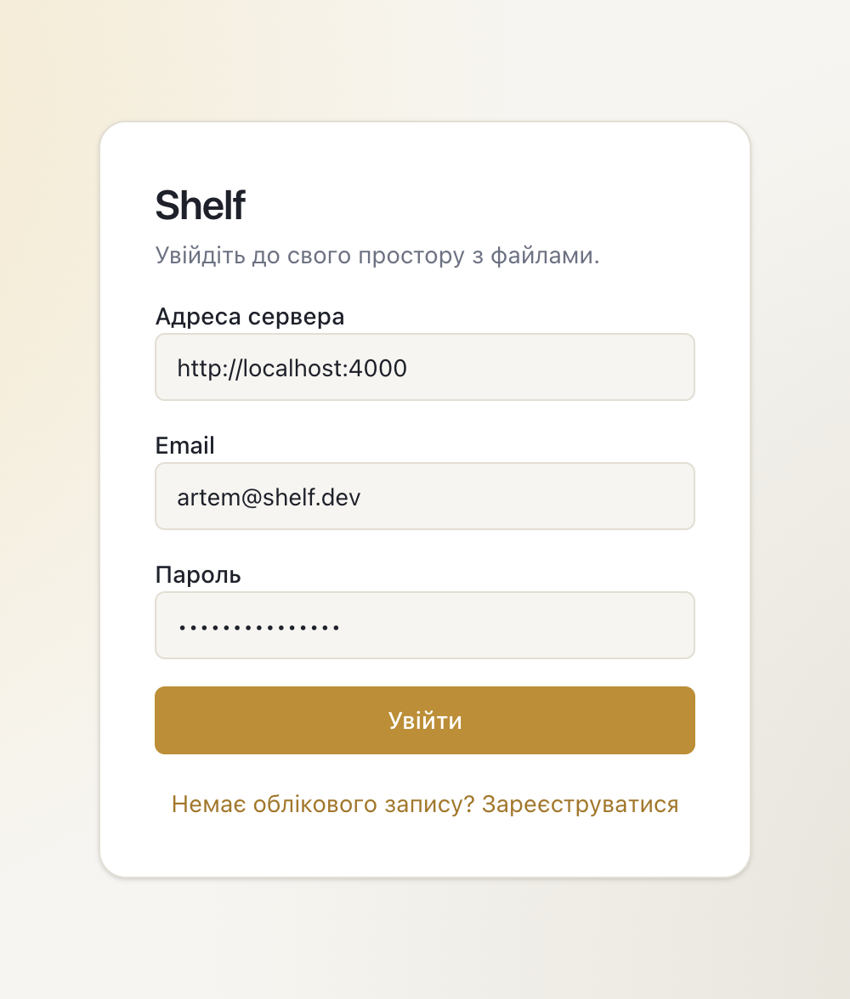{width=6cm}

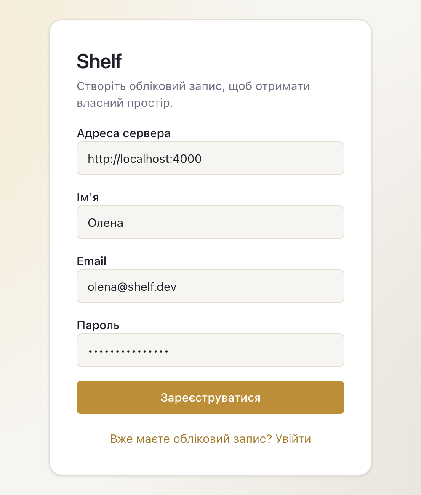{width=6cm}

## Простір і таблиця файлів

Після входу відкривається простір користувача (рис. 4) — вимога R2, прецеденти UC3
і UC4. Таблиця містить десять демонстраційних файлів у порядку зростання назв. Для
кожного показано назву з піктограмою типу, розширення, розмір, дату й час
створення та зміни, хто завантажив і хто редагував, а також кнопки скачування й
видалення. Лічильник «10 з 10» порівнює видимі рядки з усіма файлами, «Оновити»
заново запитує список. Кожен користувач має власний простір, тому в стовпцях «Хто
завантажив» і «Хто редагував» стоїть власник — «Артем»; різні імена з'явилися б
лише за спільних папок, які поза межами проєкту (§1.3 і §9 специфікації).

{width=15cm}

Ізоляцію просторів демонструють три демо-користувачі — Артем, Ірина й Максим — з
різними наборами файлів: запит чужого файлу за його `id` повертає 404, так само
як запит файлу, якого не існує.

## Сортування за назвою

Сортування — перша операція варіанта (вимога R4, прецедент UC5). Клік по заголовку
«Назва» (`SortHeaderControl`) перемикає напрямок, а піктограма показує його: «A над
Z» для зростання, «Z над A» для спадання. На рис. 5 список упорядковано за
спаданням: першим іде `Звіт.txt`, останнім — `backup.zip`. Хук
`useFileListController` зберігає напрямок і будує видимий список за інваріантом
`filterByType(sortByName(files, direction), filter)`. Порівняння виконує
`Intl.Collator`: регістр не враховується, числа в назвах ідуть у природному
порядку (`file2` перед `file10`), кириличні назви стоять після латинських. Запитів
до сервера при цьому немає.

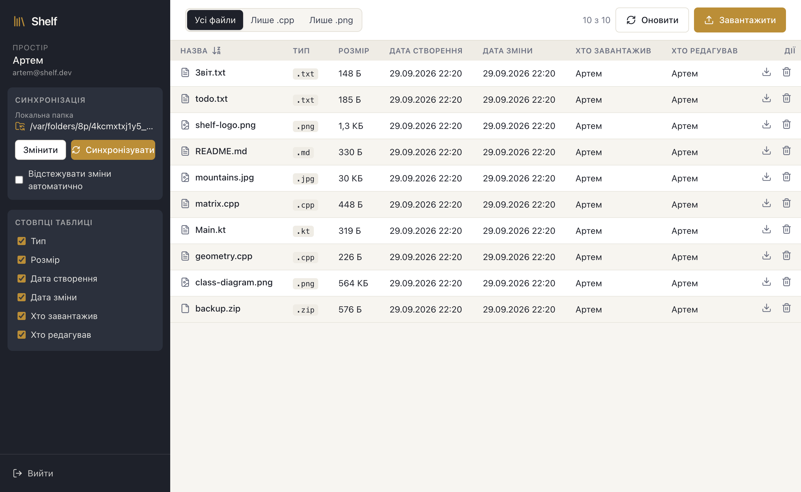{width=15cm}

## Фільтр за типом

Фільтр — друга операція варіанта (вимога R5, прецедент UC6). `TypeFilterControl`
— група кнопок «Усі файли», «Лише .cpp» і «Лише .png»; вибрана кнопка темна. На
рис. 6 увімкнено «Лише .cpp»: лишилися `geometry.cpp` і `matrix.cpp`, лічильник
показує «2 з 10». Порівнюється саме розширення без урахування регістру, тож
`Zeta.CPP` проходить фільтр, а `readme-cpp.txt` — ні. Кнопка «Усі файли» повертає
повний список; як і сортування, фільтрація відбувається на клієнті без запиту до
сервера.

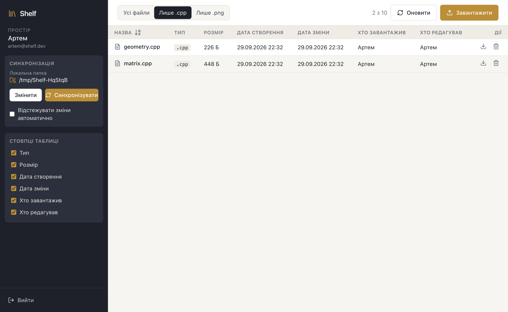{width=13cm}

На рис. 7 вибрано «Лише .png», і видно `class-diagram.png` та `shelf-logo.png`.
Фільтр застосовується поверх відсортованого списку, тому його зміна не скидає
обраного порядку: після сортування за спаданням `.cpp`-файли теж ідуть від
`matrix.cpp` до `geometry.cpp`, що перевіряє наскрізний тест інтерфейсу.

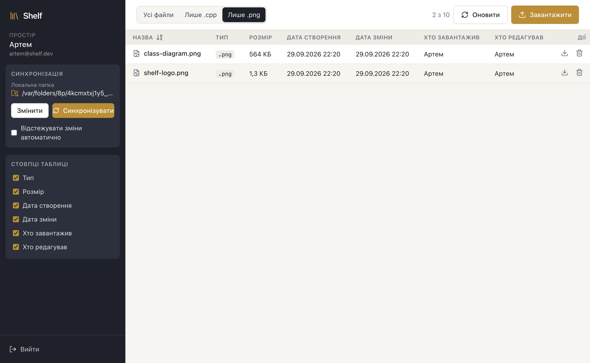{width=13cm}

## Показ і приховування стовпців

Блок «Стовпці таблиці» в бічній панелі (`ColumnPicker`) реалізує вимогу R3 і
прецедент UC7: кожен стовпець, крім назви, має свій прапорець. На рис. 8 вимкнено
«Розмір» і «Хто завантажив», і таблиця одразу втратила ці стовпці, а решта
атрибутів лишилася. Стовпця «Назва» в переліку немає: без нього рядок втратив би
сенс, тому `toggleColumn` із `@shelf/shared` ігнорує спробу його сховати, що
перевіряє unit-тест. Видимість стовпців зберігається в стані
`useFileListController` і впливає лише на відображення, дані заново не
запитуються.

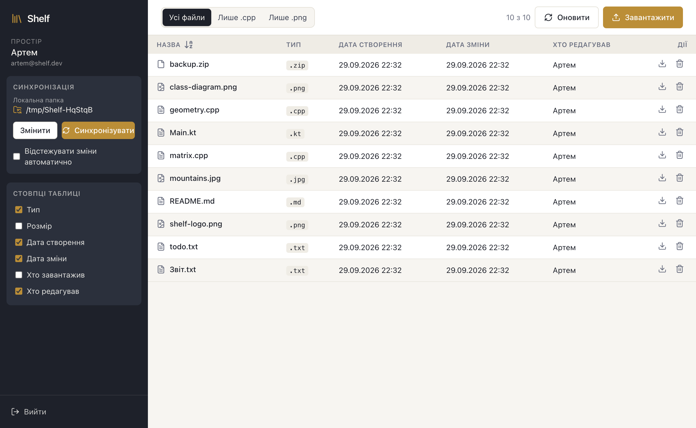{width=15cm}

## Перегляд вмісту файлу

Клік по рядку відкриває модальне вікно `PreviewDialog` — вимога R6, прецедент UC8,
тип варіанта. Спосіб перегляду визначає чиста функція `previewKindOf` за
розширенням; `createPreview` створює `TextPreview` або `ImagePreview`, клієнт
скачує вміст через `FileApiClient.download`, а `render` готує результат. На рис. 9
файл `Main.kt` показано як текст моноширинним шрифтом, над ним — розмір, дати,
автор і редактор. З великого текстового файлу показується перший мегабайт. Вікно
не виходить за межі екрана: заголовок і кнопки закріплені, вміст прокручується.

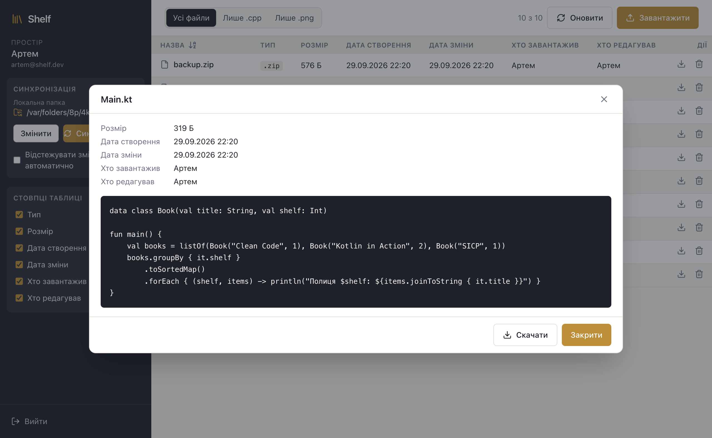{width=15cm}

Файл `mountains.jpg` на рис. 10 відкривається як зображення, масштабоване так, щоб
поміститися у вікно разом з атрибутами. Варіант вимагає лише `.kt` і `.jpg`, але
перегляд зроблено узагальнено, бо типи перегляду не збігаються з типами фільтра:
будь-який текстовий файл (`.kt`, `.cpp`, `.txt`, `.md`, `.json` тощо) показується
як текст, будь-яке растрове зображення (`.jpg`, `.jpeg`, `.png`, `.gif`, `.webp`,
`.bmp`) — як картинка.

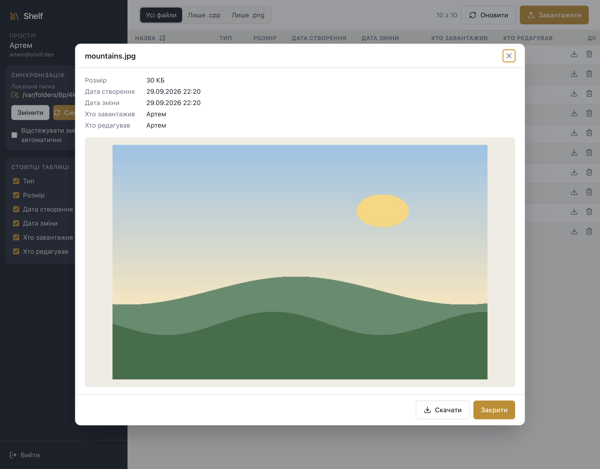{width=15cm}

Для решти типів, як-от архіву `backup.zip` на рис. 11, вікно показує тільки
атрибути і повідомлення «Перегляд недоступний для цього типу файлу»; вміст такого
файлу клієнт навіть не скачує. Кнопка «Скачати» зберігає файл на диск, а закрити
вікно можна кнопкою «Закрити», клавішею Escape або кліком поза ним.

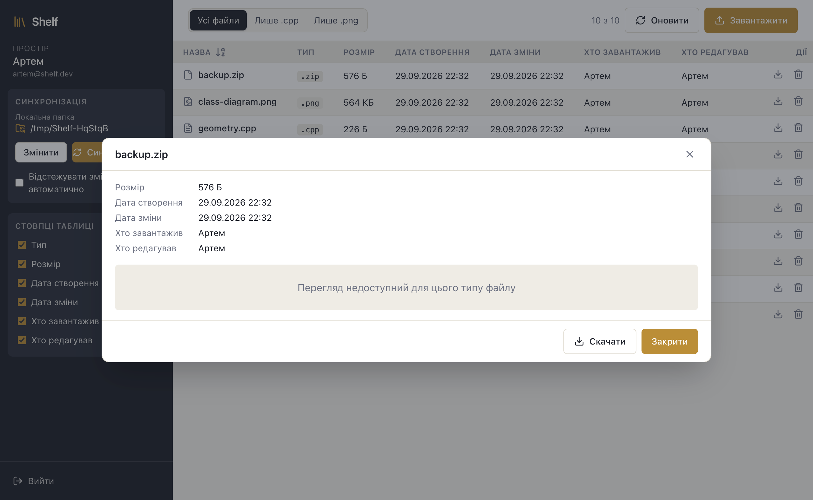{width=15cm}

## Завантаження файлів кнопкою і перетягуванням

Вивантаження на сервер покриває вимоги R7 і R9, прецеденти UC9a і UC9b. Кнопка
«Завантажити» відкриває системний діалог з вибором кількох файлів. Можна й
перетягнути файли з Finder чи Провідника на таблицю: `UploadDropzone` накриває її
шаром з пунктирною рамкою і написом «Відпустіть файли, щоб завантажити їх у
простір» (рис. 12). Шар реагує тільки на перетягування з файлами операційної
системи (у `dataTransfer.types` є `Files`), а поки користувач тягне рядок таблиці
з вікна, зона вимкнена, тож шар тоді не з'являється.

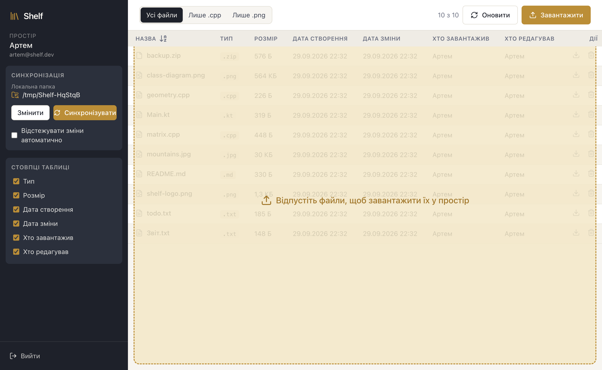{width=15cm}

Після того як файл відпущено (рис. 13), `Greeting.kt` з'явився в таблиці, лічильник
показує «11 з 11», а повідомлення — «Завантажено файлів: 1». Обмеження 50 МБ
перевіряється двічі: клієнт функцією `splitBySize` відкладає завеликі файли ще до
запиту й називає їх у повідомленні «Більші за 50 МБ і пропущені: …», а решту
вивантажує; сервер додатково відповідає на такий файл кодом 413. Файл із назвою,
яка вже є в просторі, стає його новою версією (UC10).

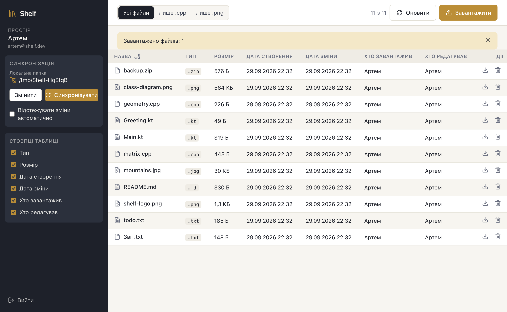{width=15cm}

## Скачування файлів

Скачування (UC11) має два способи. Кнопка зі стрілкою в рядку або «Скачати» у вікні
перегляду відкриває системний діалог збереження файлу. Другий спосіб — витягнути
рядок з вікна у Finder або Провідник (UC11a, бонус R9). Перетягування в браузері не
створює файл на диску, тому використано механізм Electron `webContents.startDrag`.
Щойно користувач натискає кнопку миші на рядку, main-процес на прохання сторінки
(`prepareDrag`) скачує файл у тимчасовий каталог `shelf-drag/<id>/<назва>`. Коли
починається перетягування, сторінка скасовує стандартну дію браузера, вимикає зону
вивантаження і викликає `startDrag`; main-процес передає системі шлях до файлу й
піктограму, і файл копіюється туди, де користувач відпустив кнопку.

## Видалення файлів

Кнопка з кошиком видаляє файл (UC12): після підтвердження клієнт надсилає
`DELETE /api/workspace/files/:id`, сервер видаляє запис і об'єкт зі сховища, а
таблиця перечитує список. Синхронізація видалень не поширює: файл, видалений на
сервері, але залишений у прив'язаній папці, наступна синхронізація вивантажить
знову — це задокументоване обмеження.

## Синхронізація з локальною папкою

Блок «Синхронізація» в бічній панелі реалізує вимогу R8 і прецеденти UC13 та UC14.
У ньому видно шлях прив'язаної папки, кнопку «Змінити» для вибору іншої, кнопку
«Синхронізувати» і прапорець автоматичного відстеження; шлях зберігається в
налаштуваннях. «Синхронізувати» запускає в main-процесі `scan()`, що порівнює
папку, список на сервері і знімок стану, а потім виконання плану з індикатором
прогресу. На рис. 14 показано першу синхронізацію папки, де лежав лише
`lab-notes.txt`: «Завантажено на сервер: 1», «Скачано з сервера: 11», «Без змін:
0», «Конфліктів: 0», а в таблиці з'явився новий файл. Скачаним файлам на диску
виставляється час зміни серверної версії, тож наступна перевірка вважає їх
незміненими.

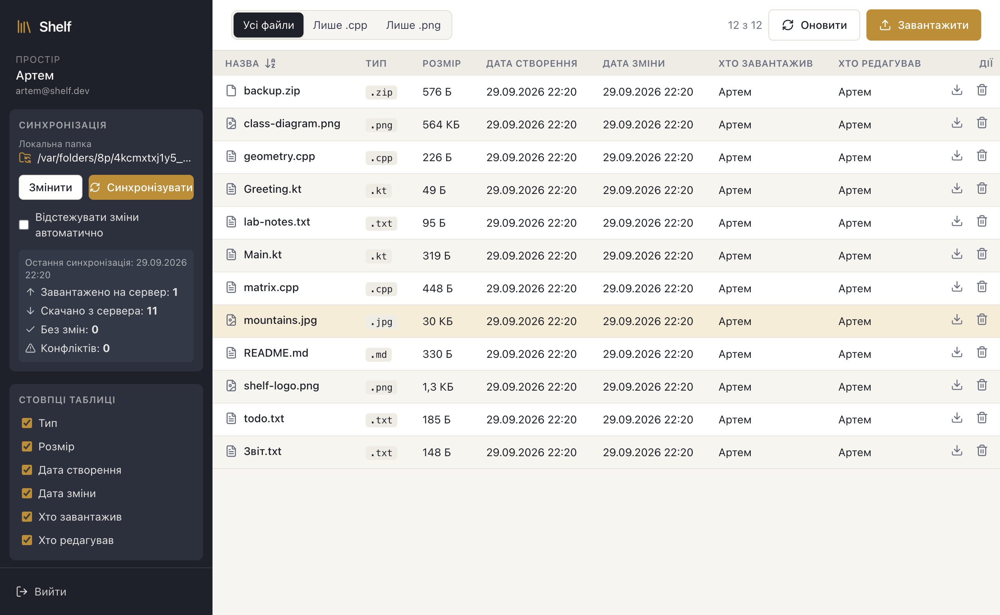{width=15cm}

## Конфлікт версій і його розв'язання

Після кожного перенесення клієнт записує в знімок стану `SnapshotEntry`: час і
розмір локального файлу, час, контрольну суму і `remoteId` серверної версії. Знімок
зберігається у `userData/snapshots/<sha1 шляху папки>.json`, окремо для кожної
папки. Файл лише з одного боку має статус `LOCAL_ONLY` або `REMOTE_ONLY`; файл з
обох боків порівнюється зі знімком: зміна лише локально дає `LOCAL_NEWER`, лише на
сервері — `REMOTE_NEWER`, з обох боків — `CONFLICT`, інакше `IN_SYNC`. «Змінилося
локально» — час поза допуском 2 с або інший розмір; «змінилося віддалено» —
`modifiedAt` поза допуском 2 с або інший `checksum`; запис знімка іншого серверного
файлу (`remoteId`) не враховується (§5.2). Без знімка вирішує контрольна сума.

На рис. 15 файл `todo.txt` змінено і в папці (22:27, 80 Б), і на сервері (22:32,
66 Б), тому відкривається `ConflictDialog` (UC14b). Для кожного файлу можна
залишити локальну версію або версію з сервера; новішу вибрано заздалегідь.
«Застосувати» передає вибір у `run(resolutions)`, а «Скасувати синхронізацію»
нічого не переносить, відкидає план і повертає роботу автоматичному відстеженню.
Файл, змінений, поки було відкрито діалог, під час повторної перевірки плану
пропускається.

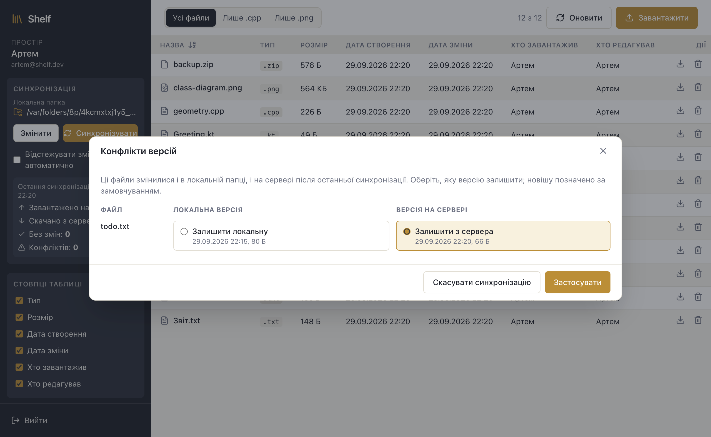{width=15cm}

Рис. 16 показує результат: версію з сервера скачано, звіт містить «Скачано з
сервера: 1», «Без змін: 11» і «Конфліктів: 1», а `todo.txt` має розмір 66 Б. Поле
«Конфліктів» рахує конфлікти, оброблені в цьому запуску, щоб було видно, що вибір застосовано.
Якщо перенесення якогось файлу не вдасться, він лишиться в попередньому стані, а
причина з'явиться червоним рядком під звітом.

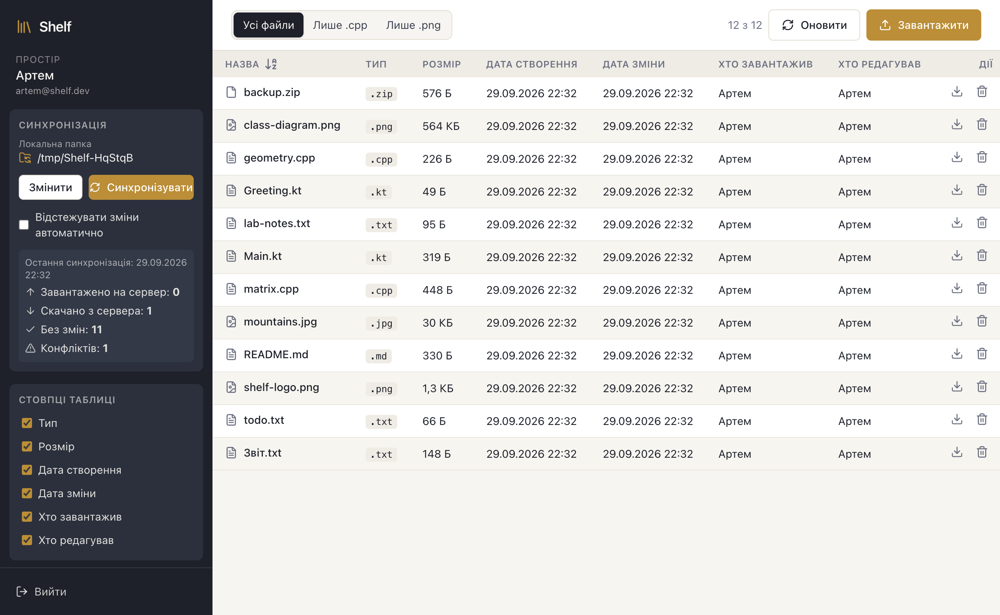{width=15cm}

## Автоматичне відстеження змін

Прапорець «Відстежувати зміни автоматично» реалізує прецедент UC14a, доступний лише
в десктопі. Він запускає `FolderWatcher`, який через `chokidar` стежить за верхнім
рівнем папки, пропускає приховані й тимчасові файли і викликає синхронізацію
через 1,5 с після останньої зміни в серії. `SyncService` одразу виконує
`synchronize()` без окремого сканування і без діалогу, тож конфлікт розв'язується
на користь новішої версії. Якщо файли змінилися під час запуску, після нього
виконується ще один; поки відкрито діалог конфліктів, автоматичні запуски чекають.
На рис. 17 у папці створено `watched.kt`, і він сам потрапив на сервер:
«Завантажено на сервер: 1», «Без змін: 12».

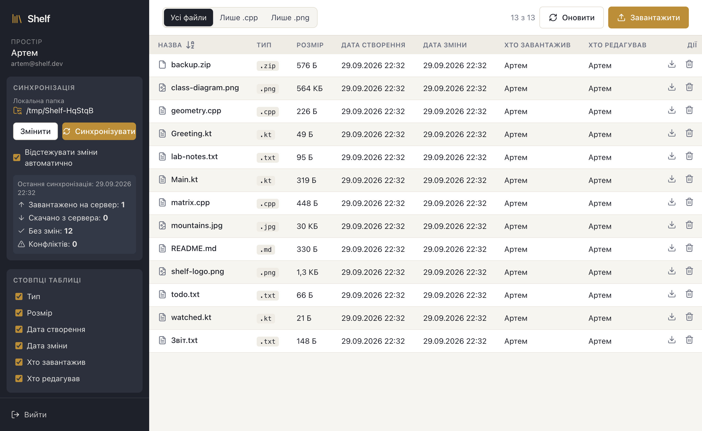{width=15cm}

# Unit-тестування

Тести розділено на три набори за пакетами; `pnpm test` у корені запускає всі, а
GitHub Actions — після кожного `push`. Кількість тестів узято з журналів запуску.

```{=latex}
\begingroup\small
```

| Набір | Що перевіряє | Тестів |
|:--------------------|:----------------------------------------------------|------:|
| `@shelf/shared` (Vitest, 11 файлів) | операції варіанта, `previewKindOf` і класи перегляду, стовпці, форматування, ліміт 50 МБ, `FileApiClient` з підміненим `fetch`, усі статуси `computeStatus`, `SyncEngine` з `MemoryLocalFolder` | 140 |
| `@shelf/api` (Jest, 8 наборів) | `AuthService`; `FilesService` (нова версія змінює `editedBy`, `modifiedAt`, `checksum`, чужий файл недоступний); `StorageService` з імітацією S3; конфігурація; українські помилки | 58 |
| `@shelf/desktop` (Vitest, 6 файлів) | `SettingsStore`, `NodeLocalFolder`, `JsonSnapshotStore`, `FolderWatcher`, `SyncService`; `SyncEngine` на справжній файловій системі з API в пам'яті | 28 |
| Разом | | 226 |

```{=latex}
\endgroup
```

## Обов'язкові тести операцій варіанта

Тести лежать у `fileListOperations.test.ts` і `preview.test.ts`; список `files`
містить записи `b.txt`, `A.kt`, `photo.jpg`, `main.cpp`, `logo.png`, `Zeta.CPP`, `notes`.

**Сортування за назвою** (група «sortByName — операція варіанта»): за зростанням
регістр не впливає на порядок, а за спаданням результат — точне дзеркало.

```{=latex}
\begingroup\scriptsize
```

```ts
  it('sorts ascending, ignoring letter case', () => {
    expect(names(sortByName(files, SortDirection.ASCENDING))).toEqual([
      'A.kt', 'b.txt', 'logo.png', 'main.cpp', 'notes', 'photo.jpg', 'Zeta.CPP',
    ]);
  });

  it('sorts descending as the exact reverse', () => {
    expect(names(sortByName(files, SortDirection.DESCENDING))).toEqual([
      'Zeta.CPP', 'photo.jpg', 'notes', 'main.cpp', 'logo.png', 'b.txt', 'A.kt',
    ]);
  });
```

```{=latex}
\endgroup
```

**Фільтр за типом** (група «filterByType — операція варіанта»): `ONLY_CPP` залишає
`.cpp`-файли за будь-якого регістру, `ONLY_PNG` — лише `.png`.

```{=latex}
\begingroup\scriptsize
```

```ts
  it('ONLY_CPP keeps only .cpp files, any letter case', () => {
    expect(names(filterByType(files, TypeFilter.ONLY_CPP))).toEqual(['main.cpp', 'Zeta.CPP']);
  });

  it('ONLY_PNG keeps only .png files', () => {
    expect(names(filterByType(files, TypeFilter.ONLY_PNG))).toEqual(['logo.png']);
  });
```

```{=latex}
\endgroup
```

**Тип перегляду** (група «previewKindOf — тип варіанта»): обов'язкові `.kt` →
`TEXT` і `.jpg` → `IMAGE`, великі літери в розширенні, інші типи.

```{=latex}
\begingroup\scriptsize
```

```ts
  it.each([
    ['Main.kt', PreviewKind.TEXT],
    ['photo.jpg', PreviewKind.IMAGE],
    ['PHOTO.JPG', PreviewKind.IMAGE],
    ['main.cpp', PreviewKind.TEXT],
    ['notes.txt', PreviewKind.TEXT],
    ['logo.png', PreviewKind.IMAGE],
    ['backup.zip', PreviewKind.NONE],
    ['noext', PreviewKind.NONE],
  ])('%s → %s', (name, kind) => {
    expect(previewKindOf(name)).toBe(kind);
  });
```

```{=latex}
\endgroup
```

## Результати запуску

Вивід `vitest run --reporter=verbose` для `@shelf/shared`, скорочений до
обов'язкових тестів і підсумку (довгі рядки перенесено):

```{=latex}
\begingroup\scriptsize
```

```
 RUN  v3.2.7 packages/shared

 ✓ src/preview.test.ts > previewKindOf — тип варіанта: .kt як текст, .jpg як зображення
     > Main.kt → TEXT 1ms
 ✓ src/preview.test.ts > previewKindOf — тип варіанта: .kt як текст, .jpg як зображення
     > photo.jpg → IMAGE 0ms
 ✓ src/fileListOperations.test.ts > sortByName — операція варіанта: сортування за назвою
     > sorts ascending, ignoring letter case 0ms
 ✓ src/fileListOperations.test.ts > filterByType — операція варіанта: фільтр «усі / лише
     .cpp / лише .png» > ONLY_CPP keeps only .cpp files, any letter case 0ms

 Test Files  11 passed (11)
      Tests  140 passed (140)
```

```{=latex}
\endgroup
```

Підсумкові рядки Jest для сервера і Vitest для десктопа:

```{=latex}
\begingroup\scriptsize
```

```
Test Suites: 8 passed, 8 total
Tests:       58 passed, 58 total

 Test Files  6 passed (6)
      Tests  28 passed (28)
```

```{=latex}
\endgroup
```

Усі 226 тестів проходять; наскрізні перевірки на живому стеку виконують
`pnpm smoke` (REST API) і `pnpm -F @shelf/desktop smoke` (інтерфейс, Playwright).

# Інструкція із запуску

Потрібні Node.js 22.12 або новіший, pnpm 10 (`corepack enable pnpm`) і Docker.

```bash
pnpm install
cp docker/.env.example docker/.env
pnpm stack:up                     # PostgreSQL, MinIO і API
pnpm seed                         # демо-користувачі та файли
pnpm -F @shelf/desktop dev        # клієнт у режимі розробки
pnpm -F @shelf/desktop dist:mac   # збірка .dmg
```

Сервер слухає `http://localhost:4000` — цю адресу клієнт і пропонує на екрані
входу. Готовий `.dmg` лежить в `apps/desktop/release`; він не підписаний
сертифікатом розробника Apple,
тому першого разу macOS не відкриває програму подвійним кліком: треба викликати
контекстне меню значка Shelf у теці «Програми», вибрати «Відкрити» і підтвердити
запуск. Облікові записи, які створює `pnpm seed` (пароль `shelf-demo-2026`):

```{=latex}
\begingroup\small
```

| Email | Ім'я | Файли в просторі |
|:----------------------|:-----------|:----------------------------------------|
| `artem@shelf.dev` | Артем | усі десять демонстраційних файлів |
| `iryna@shelf.dev` | Ірина | `todo.txt`, `geometry.cpp`, `mountains.jpg` |
| `maksym@shelf.dev` | Максим | `README.md`, `shelf-logo.png` |

```{=latex}
\endgroup
```

# Висновки

На етапі 2 створено робочу десктопну версію Shelf. Сервер на NestJS зберігає
метадані в PostgreSQL, а вміст файлів — у S3-сумісному сховищі; клієнт на Electron
виконує вимоги R1–R9, зокрема операції варіанта 8-6 і бонусний drag-and-drop в
обох напрямках. Синхронізація з локальною папкою знаходить конфлікти за знімком
стану й дає користувачу вибрати версію. Логіку зосереджено в `@shelf/shared`,
інтерфейс — у `@shelf/ui`; обидва пакети не залежать від Electron, тому веб-версія
етапу 3 використає їх без змін і додасть лише свої реалізації `LocalFolder` і
сховища знімка. Код перевіряють 226 unit-тестів, серед них обов'язкові тести операцій варіанта. Обмеження: видалення під час
синхронізації не поширюються, а сервер зберігає лише поточну версію файлу без
історії.
