```{=latex}
\makeatletter
\let\ShelfTexttt\texttt
\renewcommand{\texttt}[1]{{\ShelfTexttt{\hyphenchar\font=-1\fontdimen3\font=0pt\fontdimen4\font=0pt\relax #1}}}
\makeatother
\setlength{\emergencystretch}{5em}
\hyphenation{
  Ascending AuthForm AuthResponseDto Blueprint BrowserLocalFolder Chromium ColumnPicker
  ConflictDialog Descending Docker DragOutHandler Electron FileApiClient FileEntry
  FileEntryDto FileListController FilePreview FileTableView Finder FolderBindingStore
  FolderWatcher ImagePreview IndexedDB IndexedDbSnapshotStore JsonSnapshotStore LocalFile
  LocalFolder LoginScreen MinIO NestJS Neon NodeLocalFolder Playwright PostgreSQL
  PreviewDialog PreviewKind Render SessionProvider SettingsStore ShelfTexttt SnapshotStore
  SortDirection SortHeaderControl Storage StorageService Supabase SyncEngine SyncItem
  SyncPanel SyncReport SyncReportView SyncService SyncSnapshot SyncStatus TextPreview
  TypeFilter TypeFilterControl UploadButton UploadDropzone Vercel WebSyncService
  WorkspaceLayout WorkspaceScreen
  accountKey buildCommand computeStatus createPreview createWritable directoryPicker
  explainBrowserError explainPickerError filterByType generateValue getVisibleFiles
  hasFolderPermission healthCheckPath installCommand lastModified localStorage
  previewKindOf queryPermission requestPermission saveBlob showDirectoryPicker
  sortByName splitBySize toggleColumn transpilePackages useFileListController useWebSync
  useDesktopSync workspace System Access}
\floatplacement{figure}{htb}
\renewcommand{\topfraction}{0.9}
\renewcommand{\bottomfraction}{0.9}
\renewcommand{\textfraction}{0.07}
\setcounter{totalnumber}{3}
\setlength{\floatsep}{10pt plus 2pt minus 2pt}
\setlength{\textfloatsep}{12pt plus 2pt minus 4pt}
\setlength{\intextsep}{10pt plus 2pt minus 2pt}
\captionsetup{skip=6pt}
\widowpenalty=10000
\clubpenalty=10000
\makeatletter
\newcommand{\ShelfNeedspace}[1]{\par\begingroup\setlength{\dimen@}{#1}%
  \vskip\z@\@plus\dimen@\penalty-100\vskip\z@\@plus-\dimen@
  \vskip\dimen@\penalty9999\vskip-\dimen@\vskip\z@skip\endgroup}
% figures still waiting for a place go to the top of the next pages, before the text that follows
\newcount\ShelfBarrierPass
\newcommand{\ShelfFloatBarrier}{\par\global\ShelfBarrierPass=0 \ShelfFloatBarrierPass}
\newcommand{\ShelfFloatBarrierPass}{\ifx\@deferlist\@empty\else
  \global\advance\ShelfBarrierPass by 1
  \ifnum\ShelfBarrierPass>3 \clearpage\else\newpage\expandafter\ShelfFloatBarrierPass\fi\fi}
\makeatother
```


# Постановка задачі

Третій етап лабораторної роботи з курсу «Інформаційні технології» — веб-версія
клієнта системи **типу 2**, тобто застосунку для роботи з віддаленою папкою з
файлами на зразок спрощеного Google Drive, з графічним інтерфейсом у браузері та
звітом. Веб-клієнт працює з тим самим сервером Shelf і його REST API, що й
десктопний клієнт етапу 2.

Обидва бонуси виконано: завантаження перетягуванням є в обох клієнтах (у вебі —
підрозділ 3.7, рис. 11 і 12), а сервер, база даних, сховище файлів і веб-клієнт
опубліковані на хмарних сервісах із публічними адресами (розділ 4, рис. 19–21).

```{=latex}
\ShelfNeedspace{5cm}
```

Індивідуальну частину задає варіант **8-6**:

```{=latex}
\begingroup\small
```

| Цифра | Список | Значення |
|:------|:-----------------|:---------------------------|
| 8 | ТИПИ файлів, вміст яких показується при кліку | `.kt` — як текст, `.jpg` — як зображення |
| 6 | ОПЕРАЦІЇ | сортування за назвою (зростання / спадання); фільтр «усі файли» / «лише `.cpp`» / «лише `.png`» |

```{=latex}
\endgroup
```

Веб-клієнт реалізує ту саму UML-модель етапу 1, що й десктоп, і використовує ті
самі пакети `@shelf/shared` і `@shelf/ui` з тими самими іменами класів. Власного
коду в ньому лише стільки, скільки вимагає браузер (розділ 2).

Адреси проєкту:

- сайт: <https://shelf-opal-two.vercel.app>;
- REST API: <https://shelf-api-l989.onrender.com>, документація за шляхом `/api/docs`;
- вихідний код: <https://github.com/NONAME-lf/shelf>.

# Архітектура веб-клієнта

## Маршрути і сесія

Веб-клієнт — пакет `@shelf/web` у каталозі `apps/web` на Next.js 16 з App Router і
React 19, зі стилями Tailwind CSS 4 зі спільного `@shelf/ui/styles.css`. Маршрути —
`/login`, `/register` і `/workspace`, а корінь `/` веде в простір або на вхід. Усі
сторінки є клієнтськими компонентами (`'use client'`), тож збірка робить їх
статичними файлами, а дані браузер отримує прямо від REST API. Сесію (JWT,
користувача й адресу API) `SessionProvider` зберігає в `localStorage`, як і
десктоп, і під час відкриття сайту перевіряє запитом `GET /api/auth/me`: відповідь
401, зокрема після 24 годин дії токена, веде на вхід, а недоступний сервер сесію
не скидає. Адресу API задає під час збірки змінна `NEXT_PUBLIC_API_URL`, тому поля
адреси сервера на екрані входу немає.

## Спільні пакети і власні модулі

З `@shelf/shared` веб-клієнт без змін бере операції варіанта (`sortByName`,
`filterByType`, `getVisibleFiles`), `toggleColumn`, `previewKindOf`,
`FileApiClient`, `splitBySize`, `accountKey` і весь каталог `sync/` з `SyncEngine`
і `computeStatus`, а з `@shelf/ui` — хук `useFileListController` і компоненти від
`AuthForm` і `FileTableView` до `SyncPanel` і `ConflictDialog`, з яких складено
екрани `LoginScreen` і `WorkspaceScreen`. Власні модулі веб-клієнта (сесію
десктоп веде власним `session.ts`, решти в ньому немає; шляхи відносно
`apps/web/src`):

```{=latex}
\ShelfNeedspace{7cm}
\begingroup\footnotesize
```

| Модуль | Роль |
|:------------------------------|:-------------------------------------------------------|
| `lib/session.ts`, `lib/SessionProvider.tsx` | сесія в `localStorage`, перевірка токена, вихід після відповіді 401 |
| `lib/saveBlob.ts` | збереження скачаного файлу через object URL і `<a download>` |
| `sync/fileSystemAccess.ts` | наявність `showDirectoryPicker`, перевірка і запит дозволу на папку |
| `sync/browserLocalFolder.ts` | `BrowserLocalFolder` — `LocalFolder` на File System Access API |
| `sync/indexedDbSnapshotStore.ts` | `IndexedDbSnapshotStore` — знімок стану кожної папки в IndexedDB |
| `sync/folderBindingStore.ts` | `FolderBindingStore` — папка і прапорець відстеження облікового запису |
| `sync/webSyncService.ts` | `WebSyncService` — синхронізація, опитування кожні 5 с, запобіжники |
| `sync/useWebSync.ts` | `useWebSync` — стан синхронізації і діалогу конфліктів для екрана |
| `sync/browserErrors.ts` | `explainBrowserError`, `explainPickerError` — помилки браузера українською |

```{=latex}
\endgroup
```

## Реалізації інтерфейсів у двох клієнтах

Інтерфейси зі специфікації спільні, різняться лише реалізації; докладно їх
порівняє етап 4.

```{=latex}
\ShelfNeedspace{5cm}
\begingroup\footnotesize
```

| Інтерфейс або функція | Десктоп | Веб |
|:----------------------|:-----------------------------------|:-----------------------------------------|
| `LocalFolder` | `NodeLocalFolder` (Node `fs`) | `BrowserLocalFolder` (File System Access API) |
| `SnapshotStore` | `JsonSnapshotStore` (JSON у `userData`) | `IndexedDbSnapshotStore` (IndexedDB) |
| прив'язка папки | `SettingsStore` (`settings.json`) | `FolderBindingStore` (IndexedDB) |
| відстеження (UC14a) | `FolderWatcher` на `chokidar` | опитування кожні 5 с у `WebSyncService` |
| скачування (UC11) | «Зберегти як», перетягування з вікна | `Blob` і `<a download>` (`saveBlob`) |

```{=latex}
\endgroup
```

## Уточнення порівняно з UML етапу 1

- **UC14a — опитування.** Браузер не повідомляє сторінку про зміни в папці, тому
  `WebSyncService`, поки ввімкнено прапорець і вкладка видима, кожні 5 с перечитує
  назви, розміри й час зміни файлів і синхронізує, лише коли цей список змінився.
- **Скачування через `Blob`.** Звичайне посилання не передає заголовок
  `Authorization`, тож `FileApiClient.download` отримує байти з токеном, а
  `saveBlob` їх зберігає.
- **`LocalFolder.write` повертає справжній час зміни.** Браузер не може задати файлу
  час зміни, і скачаний файл отримує поточний. `SyncEngine` записує в знімок саме
  час, який повернув `write`; з часом серверної версії наступна перевірка вважала б
  файл зміненим локально й вивантажила б його назад.
- **Прив'язка належить обліковому запису.** Handle папки і прапорець відстеження
  лежать в IndexedDB під ключем `accountKey` (користувач і адреса API), тож інший
  користувач того самого браузера їх не успадковує.
- **Файли `.crswap` пропускаються.** Це тимчасові файли, які Chrome створює поруч
  під час запису; `BrowserLocalFolder` не включає їх до списку.
- **Дозвіл після перезавантаження.** Handle папки переживає перезавантаження
  сторінки, а дозвіл Chrome забуває, і запитати його можна лише у відповідь на дію
  користувача: автоматичні запуски тому чекають, а «Синхронізувати» спершу запитує
  дозвіл.
- **Лише Chrome і Edge.** File System Access API мають тільки браузери на Chromium;
  у Firefox і Safari блок синхронізації показує пояснення (рис. 18).

# Веб-клієнт

Компоновка вікна та сама, що в десктопі: ліворуч темна бічна панель, праворуч
панель інструментів над таблицею, перегляд і конфлікти — у модальних вікнах.
Знімки зроблено в Chromium у вікні 1280×800 на локальному стеку зі свіжими
демонстраційними даними, під обліковим записом «Артем». Кожен користувач має
власний простір, тож «Хто завантажив» і «Хто редагував» скрізь показують власника;
різні імена були б лише за спільних папок, які поза обсягом проєкту.

## Вхід і реєстрація

Екран входу (рис. 1) реалізує вимогу R1 і прецедент UC2: маршрут `/login` показує
спільний компонент `AuthForm` з полями пошти й пароля. На відміну від десктопа,
поля «Адреса сервера» тут немає, бо адресу API задано під час збірки. Після входу
`SessionProvider` зберігає JWT, і сторінка переходить на `/workspace`. Якщо
відповіді немає понад 5 с, під формою з'являється підказка «Сервер прокидається
після простою — це може тривати до хвилини» (підрозділ 4.6). Кнопка «Вийти»
завершує сесію (UC15).

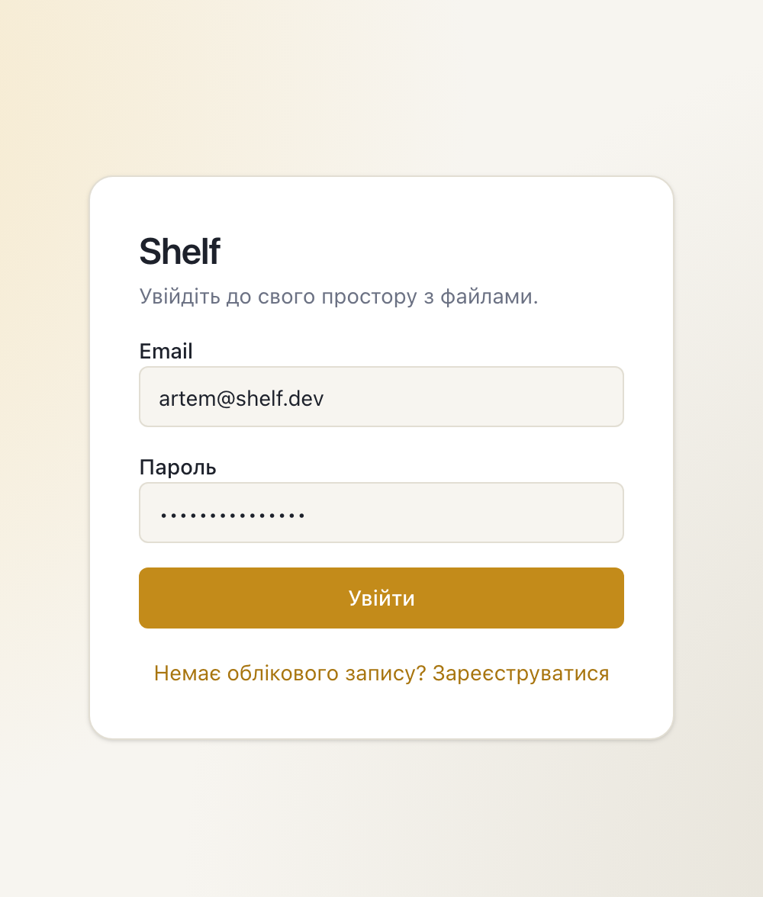{width=5cm}

Посилання під кнопкою відкриває маршрут `/register` (рис. 2, прецедент UC1) з
додатковим полем «Ім'я», яке потім видно в бічній панелі і в стовпцях авторів.
Сервер створює користувача разом із порожнім простором і відразу повертає токен,
тож окремо входити не потрібно. Помилки, як-от уже зайнята адреса пошти (код 409),
з'являються українською над кнопкою. На знімку форму заповнено для користувачки
«Олена», але не надіслано.

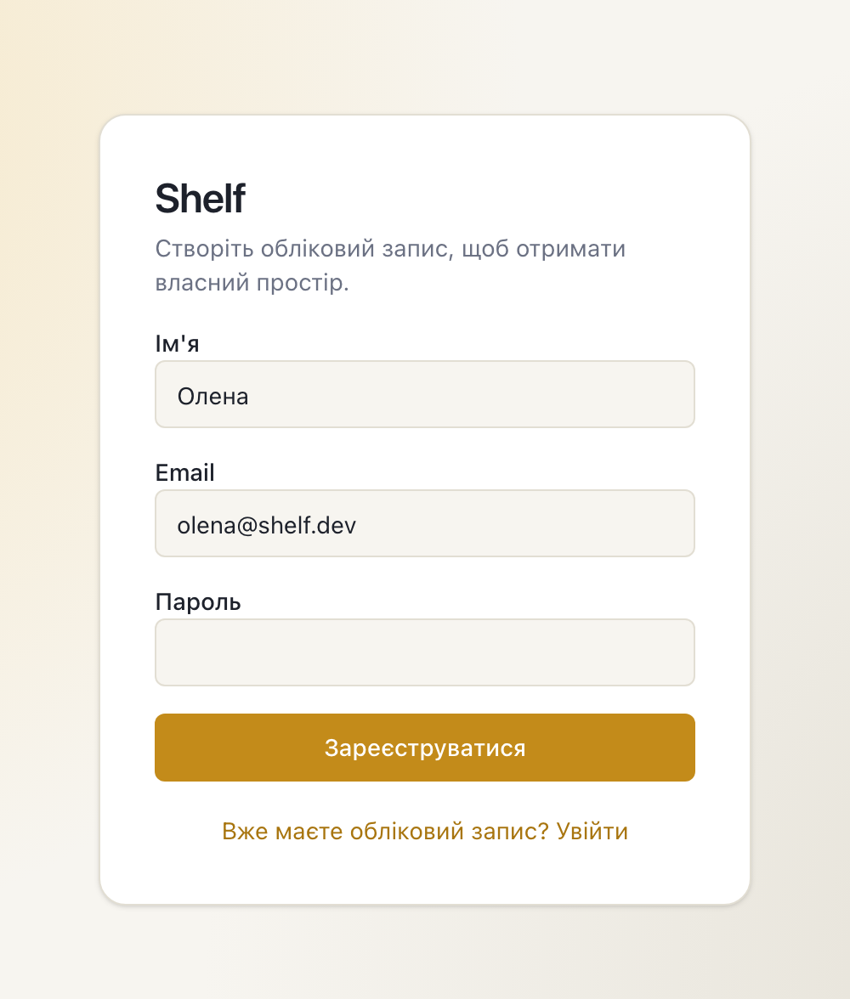{width=5cm}

## Простір і таблиця файлів

Після входу відкривається простір користувача (рис. 3) — вимога R2, прецеденти UC3
і UC4. Таблиця містить десять демонстраційних файлів за зростанням назв: назву з
піктограмою типу, розширення, розмір, дату й час створення і зміни, хто завантажив
і хто редагував, кнопки скачування й видалення. Лічильник «10 з 10» порівнює видимі
рядки з усіма файлами, «Оновити» заново запитує список. Папку ще не прив'язано,
тому блок «Синхронізація» показує «Не прив'язано» і кнопки «Обрати папку» та
«Синхронізувати».

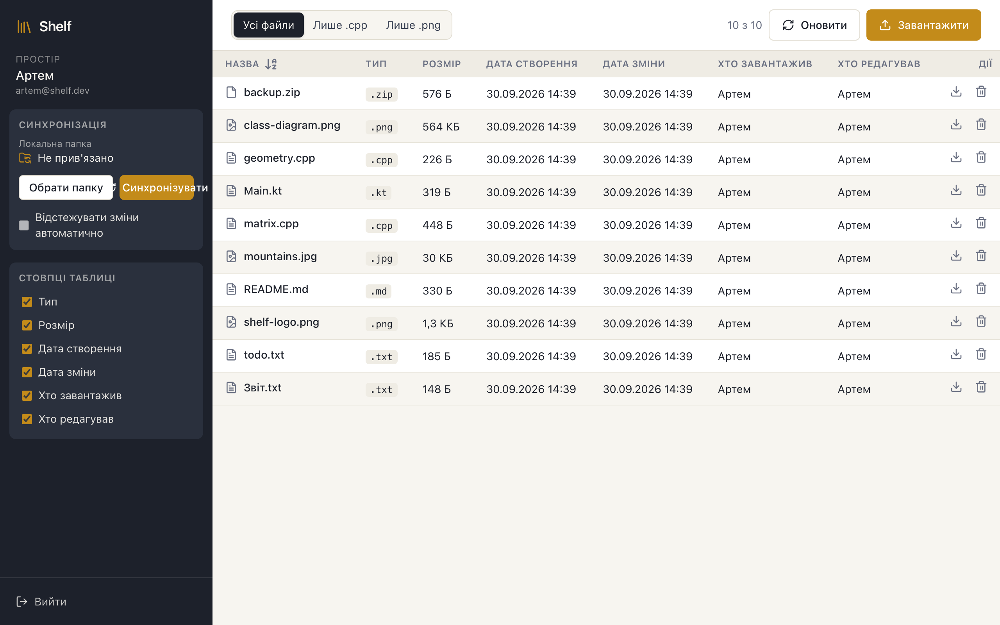{width=14cm}

## Сортування за назвою

Сортування — перша операція варіанта (вимога R4, прецедент UC5). Клік по заголовку
«Назва» перемикає напрямок, а піктограма поруч показує поточний. На рис. 4 файли
впорядковано за спаданням: першим іде `Звіт.txt`, останнім — `backup.zip`. Працює
та сама функція `sortByName` з `@shelf/shared`, що й у десктопі: `Intl.Collator`
без урахування регістру і з природним порядком чисел. Мову порівняння бере
браузер, тож в англомовному Chromium кириличні назви йдуть після латинських.

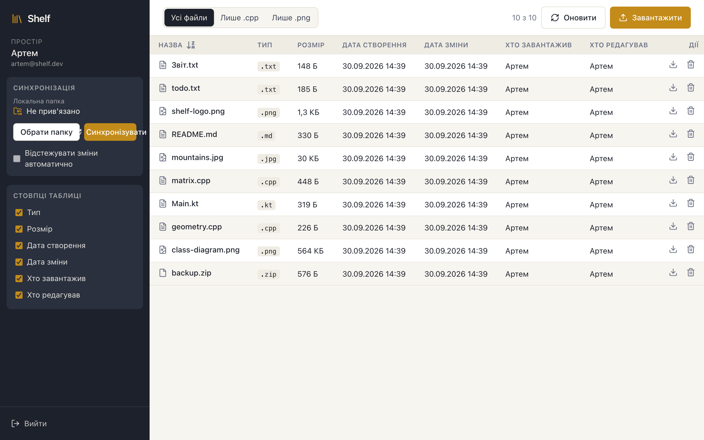{width=14cm}

## Фільтр за типом

Фільтр — друга операція варіанта (вимога R5, прецедент UC6): `TypeFilterControl`
має кнопки «Усі файли», «Лише .cpp» і «Лише .png». На рис. 5 вибрано «Лише .cpp»:
лишилися `geometry.cpp` і `matrix.cpp`, а лічильник показує «2 з 10». Порівнюється
саме розширення без урахування регістру, тож `readme-cpp.txt` фільтр не пройшов би.
Фільтр накладається на відсортований список: `getVisibleFiles` обчислює
`filterByType(sortByName(files, direction), filter)`, тож зміна фільтра не скидає
обраного напрямку сортування.

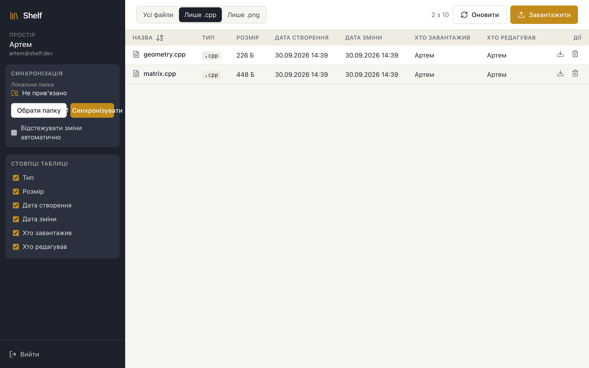{width=12cm}

На рис. 6 вибрано «Лише .png» — видно `class-diagram.png` і `shelf-logo.png`,
лічильник знову показує «2 з 10», а «Усі файли» повертає повний список. Порядок
відфільтрованих рядків задає сортування: наскрізна перевірка вмикає спадання,
потім «Лише .cpp» і переконується, що `matrix.cpp` стоїть перед `geometry.cpp`.
Обидві операції виконуються в браузері над уже отриманим списком, тому перемикання
миттєве. Обов'язкові unit-тести цих функцій описано у звіті етапу 2.

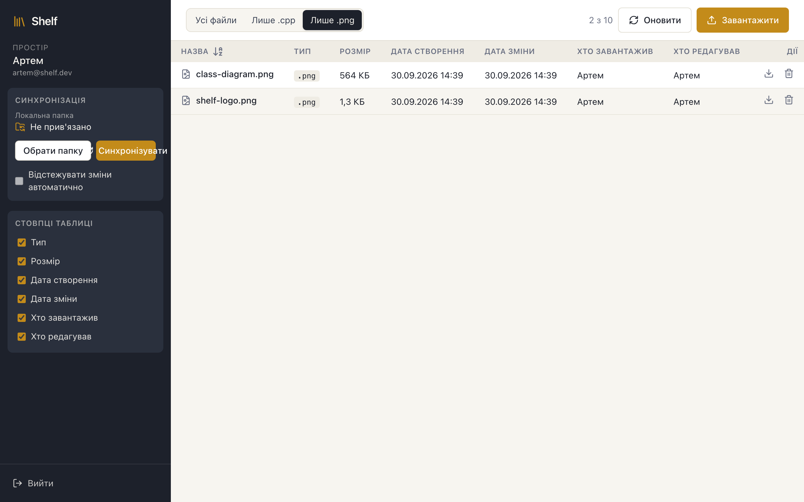{width=12cm}

## Показ і приховування стовпців

Блок «Стовпці таблиці» (`ColumnPicker`) реалізує вимогу R3 і прецедент UC7: кожен
стовпець, крім назви, має свій прапорець. На рис. 7 вимкнено «Розмір» і «Хто
завантажив», і таблиця одразу втратила ці стовпці, а решта лишилася на місці.
Назву приховати не можна: `toggleColumn` з `@shelf/shared` ігнорує таку спробу.
Видимість стовпців зберігається в стані `useFileListController` і змінює лише
відображення, тож список файлів заново не запитується.

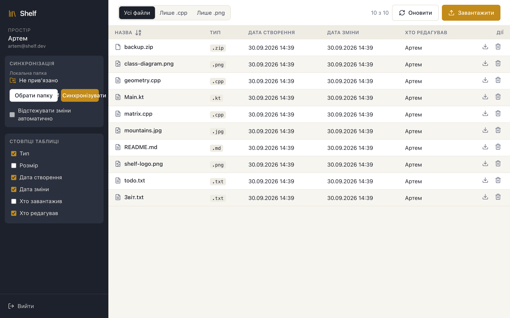{width=14cm}

## Перегляд вмісту файлу

Клік по рядку відкриває модальне вікно `PreviewDialog` — вимога R6, прецедент UC8,
тип варіанта. Спосіб перегляду визначає `previewKindOf` за розширенням,
`createPreview` створює `TextPreview` або `ImagePreview`, а вміст клієнт отримує
через `FileApiClient.download` з токеном. На рис. 8 файл `Main.kt` показано як
текст моноширинним шрифтом під розміром, датами й авторами. З великого текстового
файлу показується перший мегабайт, а довгий вміст прокручується всередині вікна,
тоді як заголовок і кнопки лишаються на місці.

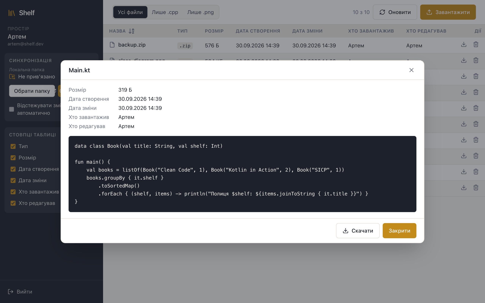{width=14cm}

Файл `mountains.jpg` на рис. 9 відкрито як зображення: `ImagePreview` перетворює
отримані байти на тимчасовий object URL, а картинка масштабується так, щоб
вміститися у вікно разом з атрибутами. Типи перегляду варіанта не збігаються з
типами фільтра, тому перегляд узагальнено: текстом показується будь-який
текстовий файл, а картинкою — будь-яке растрове зображення, зокрема `.png`. Кнопка
«Скачати» у вікні зберігає файл так само, як кнопка в рядку таблиці.

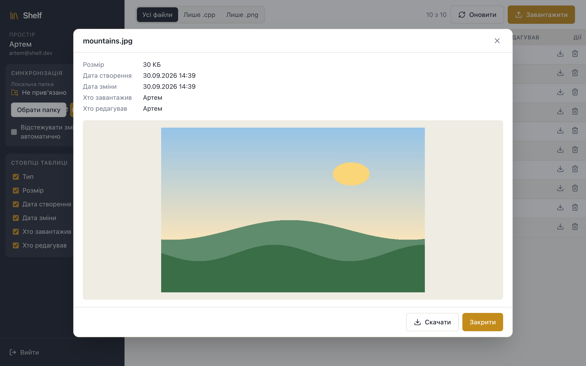{width=14cm}

Для решти типів, як-от архіву `backup.zip` на рис. 10, вікно показує лише
атрибути і напис «Перегляд недоступний для цього типу файлу», а вміст такого файлу
клієнт навіть не скачує. Закрити вікно можна кнопкою «Закрити», хрестиком,
клавішею Escape або кліком поза ним. `PreviewDialog` — спільний компонент, тому
вікно не відрізняється від десктопного. Наскрізна перевірка відкриває `.kt`, `.jpg`
і файл без перегляду й перевіряє кожен варіант вмісту.

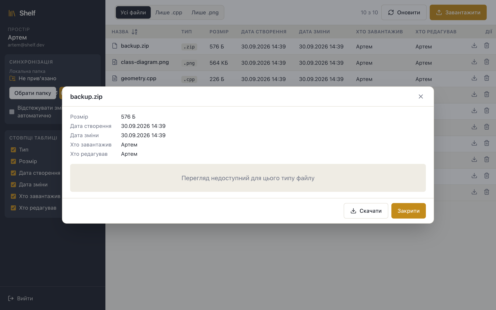{width=14cm}

## Завантаження кнопкою і перетягуванням

Вивантаження на сервер покриває вимоги R7 і R9, прецеденти UC9a і UC9b. Кнопка
«Завантажити» відкриває діалог браузера з вибором кількох файлів. Бонусний спосіб —
перетягнути файли з Finder чи Провідника на таблицю: `UploadDropzone` накриває її
шаром із пунктирною рамкою і написом «Відпустіть файли, щоб завантажити їх у
простір» (рис. 11). Шар з'являється, лише коли в `dataTransfer.types` є `Files`,
тобто тягнуть саме файли, і зникає, коли курсор залишає область.

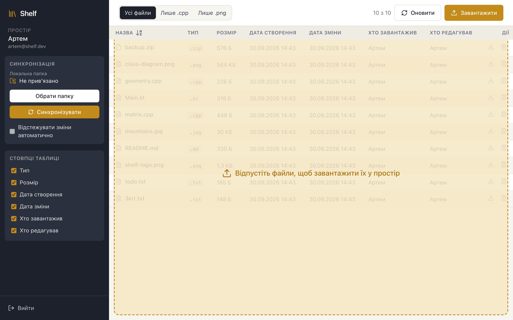{width=14cm}

Після того як файл відпущено (рис. 12), `Greeting.kt` з'явився в таблиці, лічильник
показує «11 з 11», а повідомлення — «Завантажено файлів: 1». Ліміт 50 МБ
перевіряється двічі: `splitBySize` відкладає завеликі файли ще до запиту й називає
їх у повідомленні «Більші за 50 МБ і пропущені: …», а сервер на такий файл
відповідає кодом 413. Наскрізна перевірка кидає разом малий файл і файл понад
50 МБ і переконується, що вивантажено лише малий. Файл з уже наявною назвою стає
новою версією (UC10).

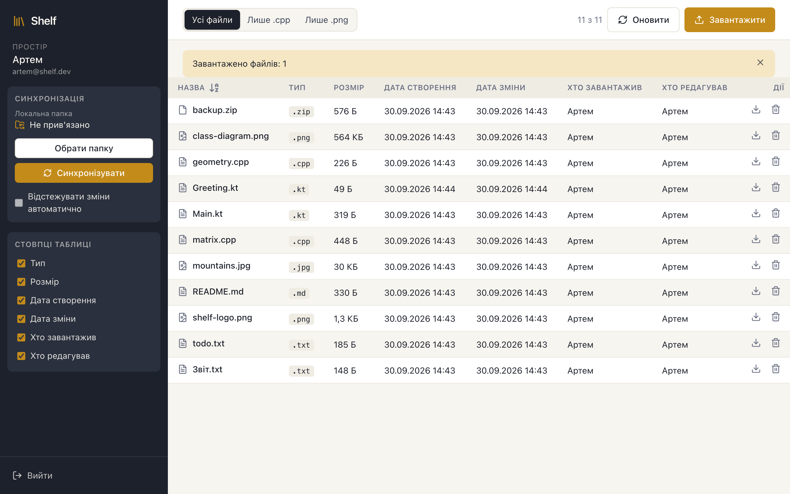{width=14cm}

## Скачування і видалення файлів

Скачування (UC11) запускає кнопка зі стрілкою в рядку або «Скачати» у вікні
перегляду: `FileApiClient.download` отримує вміст із токеном, а `saveBlob` створює
для `Blob` тимчасовий object URL, натискає невидиме посилання з атрибутом
`download` і через 10 с звільняє URL. Перетягування рядка з вікна у файловий
менеджер (UC11a) лишилося тільки в десктопі: стандартного способу створити файл
там, де відпущено кнопку миші, браузер сторінці не дає.

Кнопка з кошиком видаляє файл (UC12). Після стандартного підтвердження браузера
«Видалити «назва» з простору?» клієнт надсилає `DELETE /api/workspace/files/:id`,
сервер видаляє запис і об'єкт у сховищі, а таблиця перечитує список. Як і в
десктопі, синхронізація видалень не поширює.

## Синхронізація з локальною папкою

Блок «Синхронізація» реалізує вимогу R8 і прецеденти UC13 та UC14. «Обрати папку»
викликає `showDirectoryPicker` з доступом на читання і запис; сторінка отримує
handle папки, але не шлях до неї, тому в панелі видно лише назву. «Синхронізувати»
перевіряє дозвіл на папку, після чого `WebSyncService` викликає `scan()` рушія
`SyncEngine`, який порівнює папку, список на сервері і знімок з
`IndexedDbSnapshotStore`.

На рис. 13 — перша синхронізація папки `Shelf`, де лежав лише `lab-notes.txt`:
«Завантажено на сервер: 1», «Скачано з сервера: 11», «Без змін: 0», «Конфліктів:
0», у таблиці 12 файлів. Замість «Обрати папку» з'явилася кнопка «Змінити»: інша
папка отримує новий знімок, а повторний вибір тієї самої зберігає старий.
Системний діалог вибору папки Playwright відкрити не може, тому скрипт зйомки
підставляє каталог `Shelf` з приватної файлової системи сайту (Origin Private File
System), з яким клієнт працює через той самий File System Access API.

{width=14cm}

## Конфлікт версій і його розв'язання

Файл, змінений після останньої синхронізації і в папці, і на сервері, отримує
статус `CONFLICT` за правилами спільної функції `computeStatus`. Для рис. 14 на
сервер вивантажено іншу версію `todo.txt` (66 Б), а потім змінено локальний файл
(114 Б). «Синхронізувати» відкрило `ConflictDialog` (UC14b), де для кожного файлу
вибирають локальну версію або версію з сервера; новішу, тут локальну, вибрано
заздалегідь. «Застосувати» передає вибір у `run(resolutions)`, а «Скасувати
синхронізацію» відкидає план і нічого не переносить.

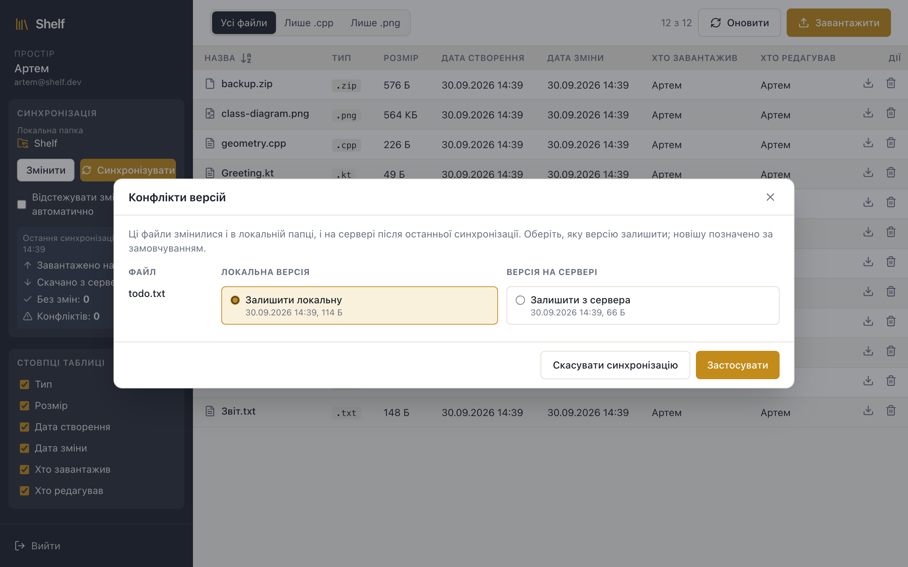{width=14cm}

Рис. 15 показує результат після «Застосувати»: локальну версію вивантажено, звіт
містить «Завантажено на сервер: 1», «Без змін: 11» і «Конфліктів: 1», а `todo.txt`
у таблиці має 114 Б і новий час зміни. Поле «Конфліктів» рахує конфлікти,
розв'язані в цьому запуску. Файл, змінений, поки діалог був відкритий, під час
повторної перевірки плану пропускається з повідомленням у звіті, а помилки
файлової системи браузера `explainBrowserError` перекладає українською.

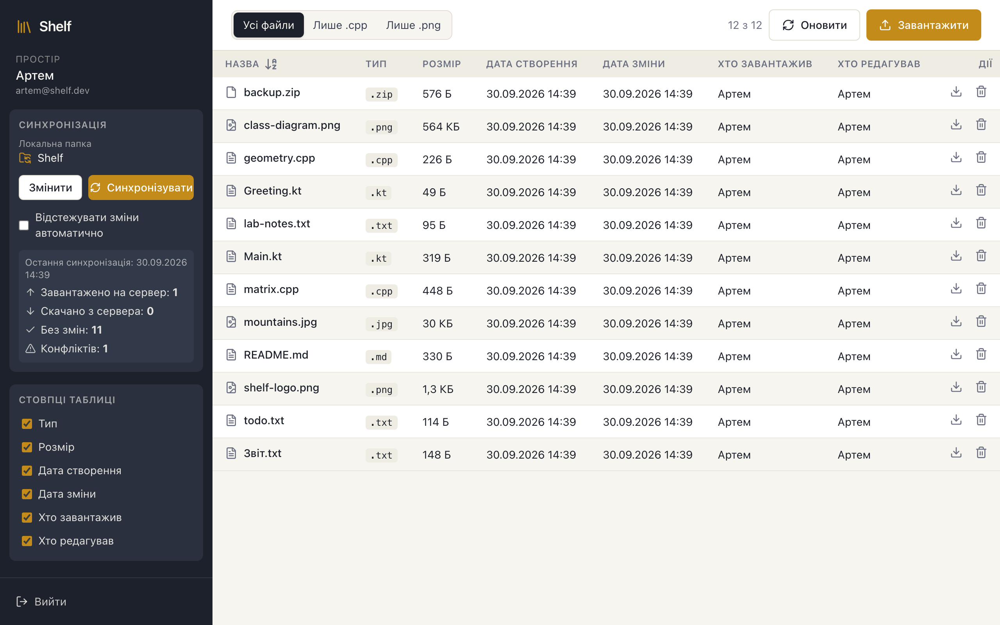{width=14cm}

## Автоматичне відстеження змін

Прапорець «Відстежувати зміни автоматично» реалізує прецедент UC14a опитуванням
(підрозділ 2.4): коли список файлів папки змінився, `WebSyncService` виконує
`synchronize()` без діалогу, і конфлікт розв'язується на користь новішої версії.
Як і в десктопному `SyncService`, одночасно працює один запуск, відкритий діалог
конфліктів притримує автоматичні запуски, а ручна синхронізація чекає на
автоматичну.

На рис. 16 файл `watched.kt`, що з'явився в папці, сам потрапив на сервер:
таблиця показує «13 з 13», а звіт — «Завантажено на сервер: 1» і «Без змін: 12».
Прапорець зберігається разом із прив'язкою папки облікового запису. Після виходу
опитування зупиняється, а результат запуску, що завершився пізніше, відкидається.
Якщо після перезавантаження сторінки дозволу на папку немає, блок один раз просить
натиснути «Синхронізувати» і дозволити доступ, а опитування чекає.

{width=14cm}

## Вузький екран

Коли вікно вужче за 768 px, `WorkspaceLayout` ховає бічну панель: у панелі
інструментів з'являється кнопка меню, кнопки переносяться на другий рядок, а
таблицю можна прокручувати вбік (рис. 17, ліворуч). Кнопка меню висуває панель
поверх вмісту (праворуч) з тими самими блоками синхронізації і стовпців; закривають
її хрестиком або кліком по затемненій частині сторінки. Знімки зроблено у вікні
390×844, як на смартфоні. Синхронізація на телефоні залежить від браузера: там,
де немає `showDirectoryPicker` (зокрема в Safari), блок покаже пояснення з
наступного підрозділу.

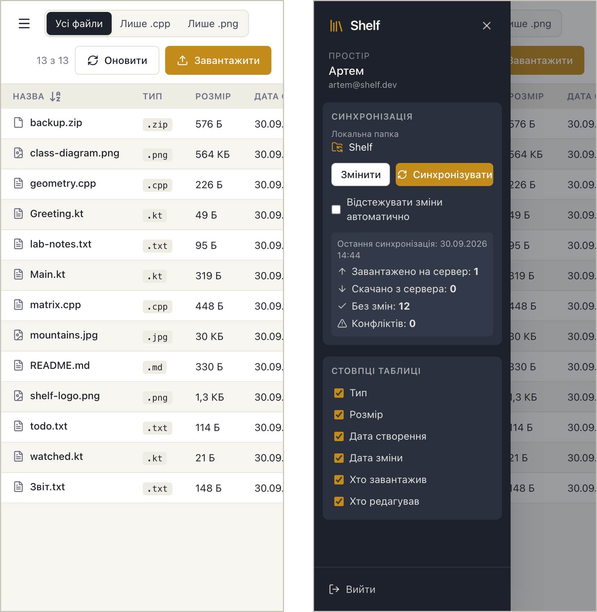{width=10.5cm}

## Браузери без File System Access API

`showDirectoryPicker` є лише в браузерах на основі Chromium, зокрема Chrome і Edge,
і тільки на сторінках, відкритих через HTTPS або з `localhost`. Якщо функція
`directoryPicker` його не знаходить, `useWebSync` не створює `WebSyncService`, а
`SyncPanel` показує замість кнопок пояснення «Синхронізація з локальною папкою
працює в Chrome і Edge (потрібен File System Access API)…» (рис. 18); решта функцій
працює як звичайно. Для знімка в Chromium прибрано `showDirectoryPicker`, щоб він
поводився як Firefox чи Safari; цей випадок перевіряє і наскрізний тест.

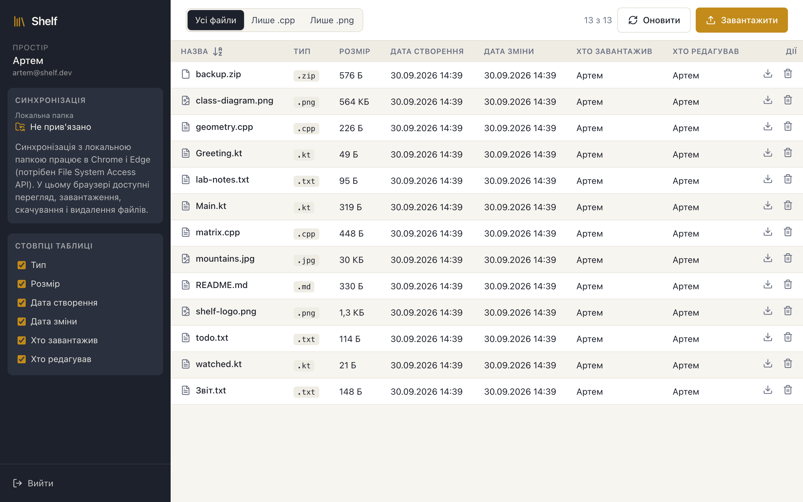{width=14cm}

```{=latex}
\ShelfFloatBarrier
```

# Публікація

## Схема розгортання

Опублікована система відповідає діаграмі розгортання етапу 1 (рис. 19). Браузер
отримує сторінки з Vercel, а дані — від API на Render; сервер у контейнері Docker
звертається до Neon через Prisma і до Supabase Storage через S3 API; десктоп
працює з тим самим API, а локальний Docker Compose запускає той самий образ із
PostgreSQL і MinIO. Уточнень два: сервер слухає порт зі змінної `PORT`, яку задає
Render (локально — 4000), а не 3000, як на діаграмі; сторінки Next.js статичні,
серверного рендерингу немає.

{width=16cm}

```{=latex}
\ShelfNeedspace{5cm}
\begingroup\footnotesize
```

| Компонент | Сервіс | План | Адреса або роль |
|:-------------|:---------------------------|:----------------|:--------------------------------------|
| веб-клієнт | Vercel | Hobby | `shelf-opal-two.vercel.app`, статичні сторінки Next.js |
| REST API | Render, Docker web service з `render.yaml` | Free, Frankfurt | `shelf-api-l989.onrender.com`, NestJS у контейнері |
| база даних | Neon PostgreSQL, пряме з'єднання | Free, Frankfurt | користувачі, простори, записи про файли |
| сховище файлів | Supabase Storage, S3-сумісний ендпоінт | Free | вміст файлів у бакеті `shelf` |
| CI | GitHub Actions | безкоштовний | збірка і тести на кожен `push` і pull request |

```{=latex}
\endgroup
```

## Опублікована система

Рис. 20 — опублікований сайт <https://shelf-opal-two.vercel.app> після входу як
`artem@shelf.dev`: ті самі десять демонстраційних файлів, що й локально, з датою
створення 30.09.2026 14:08, коли їх вивантажено на опублікований сервер
(підрозділ 4.5). Сторінку віддав Vercel, список файлів прийшов від API на Render, а той прочитав метадані з
Neon. Під час зйомки в опублікованому просторі нічого не змінювалося, а наскрізна
перевірка з розділу 5 працює з тимчасовими обліковими записами.

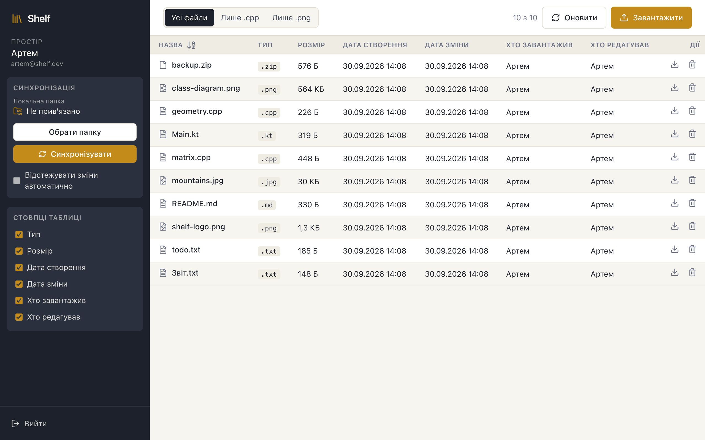{width=14cm}

На рис. 21 — Swagger UI опублікованого сервера
(<https://shelf-api-l989.onrender.com/api/docs>). Маршрути згруповано за
контролерами `health`, `auth`, `workspace` і `files`; замок позначає маршрути, що
потребують токена, а кнопка «Authorize» дає змогу вставити JWT і викликати їх
просто з браузера. Сторінка підтверджує, що за публічною адресою працює той самий
API, що й локально, і дозволяє перевірити реєстрацію, вхід, вивантаження та
скачування без клієнта. Разом із сайтом це становить бонус за публікацію.

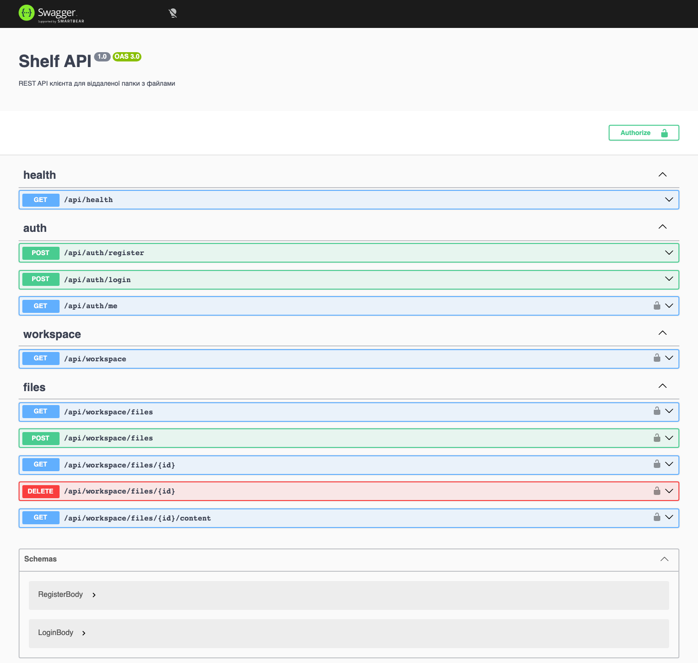{width=10cm}

## Сервер на Render

Сервер описано у файлі `render.yaml` (Render Blueprint): сервіс `shelf-api` типу
web, середовище Docker, план free, регіон frankfurt. Образ збирається з того
самого `docker/api.Dockerfile`, що й локально: перший етап встановлює лише
`@shelf/api` із залежностями і збирає його разом з `@shelf/shared`, другий містить
тільки готові файли й працює від користувача `node`. Контейнер спершу виконує
`prisma migrate deploy`, а потім запускає сервер; готовність Render перевіряє
запитом `/api/health`.

Секретів у репозиторії немає: змінні з позначкою `sync: false` (`DATABASE_URL`,
адресу, регіон і ключі S3, `CORS_ORIGINS`) введено в панелі Render під час
створення сервісу,
`JWT_SECRET` Render згенерував сам (`generateValue: true`), а у файлі записано лише
бакет `shelf`, адресацію S3 за шляхом і ввімкнений Swagger. `DATABASE_URL` —
пряме з'єднання з Neon (теж Frankfurt) без пулера, бо ту саму змінну використовує
`prisma migrate deploy`, якому потрібен сеанс із базою напряму. Supabase Storage
підключено через S3-сумісний ендпоінт; `StorageService` працює з ним тим самим
кодом, що й з MinIO.

## Веб-клієнт на Vercel

Проєкт Vercel під'єднано до репозиторію GitHub з коренем `apps/web` (Root
Directory). Оскільки це монорепозиторій pnpm, команди встановлення і збірки задано
у файлі `apps/web/vercel.json`:

```bash
ELECTRON_SKIP_BINARY_DOWNLOAD=1 pnpm install --filter @shelf/web...
pnpm --filter @shelf/web... run build
```

Перша команда встановлює лише веб-клієнт разом із `@shelf/shared` і `@shelf/ui` та
не скачує Electron, потрібний тільки десктопу. Друга спершу збирає `@shelf/shared`,
а потім сам клієнт. Адресу API задає змінна проєкту `NEXT_PUBLIC_API_URL`, яку
Next.js вбудовує в код під час збірки; якщо її не задано, перевірка в
`next.config.ts` зупиняє збірку на Vercel, і сайт, що звертався б до
`http://localhost:4000`, не публікується.

## CORS і демонстраційні дані

Сторінки й API мають різні домени, тож відповіді API сторінка читає лише з
дозволу CORS. Сервер дозволяє будь-яке джерело (`*`): NestJS повторює в
`Access-Control-Allow-Origin` адресу сторінки, що надіслала запит. Це безпечно, бо
сесія передається не в cookie, а токеном у заголовку `Authorization`, який браузер
сам не додає: чужа сторінка без токена отримає 401, а токен з `localStorage` сайту
Shelf прочитати не зможе. Перелік дозволених адрес довелося б доповнювати ще й
сторінкою десктопа, відкритою з локального файлу.

Демонстраційні дані записано тією самою командою `pnpm seed`, що й локально,
лише зі змінною `SHELF_API`, яка містить адресу опублікованого API. Скрипт
`tools/seed-demo.mjs` не звертається до бази напряму, а реєструє користувачів (або
входить, якщо вони вже є) і вивантажує файли через публічний REST API, тож його
можна запускати повторно.

## Обмеження безкоштовних планів

Для демонстрації важливі два обмеження. Безкоштовний сервіс Render засинає після
15 хвилин без запитів, і перший запит чекає до хвилини, поки запуститься
контейнер (клієнт через 5 с показує про це підказку), тож сайт краще відкрити
заздалегідь. Supabase призупиняє безкоштовний
проєкт після 7 днів без активності, і вміст файлів стає недоступним, доки проєкт не
відновлять у його панелі, тож напередодні захисту сховище варто перевірити.

```{=latex}
\ShelfFloatBarrier
```

# Тестування

## Unit-тести

`pnpm test` у корені запускає тести всіх пакетів: їх 300, і всі проходять
(GitHub Actions виконує їх на кожен `push` і pull request). Порівняно з етапом 2
додано тести `accountKey`, `@shelf/ui` і весь набір `@shelf/web`.

```{=latex}
\begingroup\footnotesize
```

| Набір | Засіб | Що перевіряє | Тестів |
|:--------------|:-------------------|:------------------------------------------------------|------:|
| `@shelf/shared` | Vitest, 12 файлів | операції варіанта, перегляд, `FileApiClient`, `SyncEngine` | 142 |
| `@shelf/ui` | Vitest, 1 файл | текст повідомлення після завантаження | 2 |
| `@shelf/api` | Jest, 8 наборів | `AuthService`, `FilesService`, `StorageService`, помилки | 58 |
| `@shelf/desktop` | Vitest, 7 файлів | `NodeLocalFolder`, `FolderWatcher`, `SyncService` | 42 |
| `@shelf/web` | Vitest, 7 файлів | сесія, `BrowserLocalFolder`, IndexedDB, `WebSyncService` | 56 |
| разом | | | 300 |

```{=latex}
\endgroup
```

Тести веб-клієнта працюють у Node без браузера: File System Access API замінюють
handle-и в пам'яті з поведінкою Chromium (`src/test/fakeFileSystem.ts`), IndexedDB —
`fake-indexeddb`, сервер — API в пам'яті. Вони перевіряють ризики, властиві саме
браузеру: скачаний файл наступного разу має статус `IN_SYNC` і не вивантажується
назад; файли `.crswap` не потрапляють до списку; без дозволу на папку, як після
перезавантаження, відстеження чекає, а ручна синхронізація запитує дозвіл; другий
обліковий запис не отримує папки першого; невдале скачування нового файлу не лишає
порожнього файлу, який наступний запуск вивантажив би на сервер.

Тіло першого з цих тестів (`browserLocalFolder.test.ts`): через годину після
скачування сканування бачить `IN_SYNC`, а вивантажень на сервер немає.

```{=latex}
\begingroup\scriptsize
```

```ts
    const api = new FakeApi();
    const snapshots = new MemorySnapshotStore();
    const engine = () => new SyncEngine({ localFolder: folder, snapshotStore: snapshots, api });
    const entry = await api.put('photo.jpg', 'jpg-bytes');

    expect(await engine().synchronize()).toMatchObject({ downloaded: 1, uploaded: 0, errors: [] });
    expect(root.lastModified('photo.jpg')).not.toBe(Date.parse(entry.modifiedAt));

    clock.advance(HOUR);
    expect((await engine().scan()).map((item) => item.status)).toEqual([SyncStatus.IN_SYNC]);
    expect(await engine().synchronize()).toMatchObject({ uploaded: 0, downloaded: 0, skipped: 1 });
    expect(api.uploads).toBe(0);
```

```{=latex}
\endgroup
```

## Наскрізна перевірка

Сценарій `apps/web/scripts/smoke.mjs` (`pnpm -F @shelf/web smoke`) збирає клієнт,
запускає `next start`, створює новий обліковий запис і через Playwright керує
Chromium. Його 20 кроків: перехід на вхід, коли сервер відхиляє збережений токен, вхід і
сортування, спадання з
«Лише .cpp», «Лише .png», стовпці, три види перегляду, зона перетягування без
файлів і з файлами, перетягування з пропуском файлу понад 50 МБ, кнопка
«Завантажити» і видалення, скачування, перша синхронізація без `.crswap`, повторна
без змін, конфлікт, відстеження, вузьке вікно, вихід, реєстрація, папка облікового
запису і браузер без File System Access API.

Той самий сценарій зі змінними `SHELF_WEB` і `SHELF_API` пройшов усі 20 кроків на
опублікованих сайті й сервері, а `tools/api-smoke.sh` виконав 20 перевірок
опублікованого API (реєстрація, коди 401, 409, 413 і 404, нова версія файлу,
видалення); обидві перевірки створюють власні тимчасові облікові записи
(фрагмент журналів; повністю — `docs/reports/img/stage3/smoke-api-prod.txt` і
`smoke-web-prod.txt`):

```{=latex}
\begingroup\scriptsize
```

```
$ SHELF_API=https://shelf-api-l989.onrender.com bash tools/api-smoke.sh
ok  re-upload same name → 200
ok  51 MB → 413
api-smoke: OK
$ SHELF_WEB=https://shelf-opal-two.vercel.app \
  SHELF_API=https://shelf-api-l989.onrender.com node apps/web/scripts/smoke.mjs
ok  login, table sorted ascending
ok  a second sync changes nothing: downloaded files are not uploaded back
ok  conflict dialog: the chosen server version replaced the local file
web-smoke: OK
```

```{=latex}
\endgroup
```

# Інструкція із запуску

Потрібні Node.js 22.12 або новіший, pnpm 10 (`corepack enable pnpm`) і Docker.
Локальний запуск:

```bash
pnpm install
pnpm build                          # збирає пакети, серед них @shelf/shared
cp docker/.env.example docker/.env
pnpm stack:up                       # PostgreSQL, MinIO і API на :4000
pnpm seed                           # демонстраційні користувачі та файли
pnpm dev:web                        # веб-клієнт на http://localhost:3000
```

Синхронізація з папкою працює в Chrome або Edge, і для `localhost` HTTPS не
потрібен. Опубліковану систему можна
відкрити без встановлення: сайт
<https://shelf-opal-two.vercel.app>, документація API
<https://shelf-api-l989.onrender.com/api/docs>. Демонстраційні облікові записи:
`artem@shelf.dev` (Артем, десять файлів), `iryna@shelf.dev` (Ірина, три файли) і
`maksym@shelf.dev` (Максим, два файли); пароль у всіх `shelf-demo-2026`. Після 15
хвилин без запитів сервер засинає, тож перший вхід може тривати до хвилини.

# Висновки

На етапі 3 створено веб-версію Shelf на Next.js 16. Вона виконує вимоги R1–R8,
зокрема сортування за назвою, фільтр «усі / лише .cpp / лише .png», перегляд `.kt`
як тексту і `.jpg` як зображення, а також бонусне завантаження перетягуванням.
Сервер, база, сховище й веб-клієнт опубліковані на Render, Neon, Supabase і Vercel,
і наскрізна перевірка пройшла за публічними адресами. З десктопом спільні операції
варіанта, REST-клієнт, рушій синхронізації і всі компоненти інтерфейсу; новими
стали сесія, збереження файлів і реалізації `LocalFolder` та `SnapshotStore`.
Браузер змусив змінити кілька рішень: відстеження змін опитуванням, скачування
через `Blob`, запис у знімок справжнього часу зміни, повторний запит дозволу на
папку і синхронізацію лише в Chrome та Edge. Код перевіряють 300 unit-тестів. На
етапі 4 ці відмінності двох клієнтів буде порівняно докладно.
