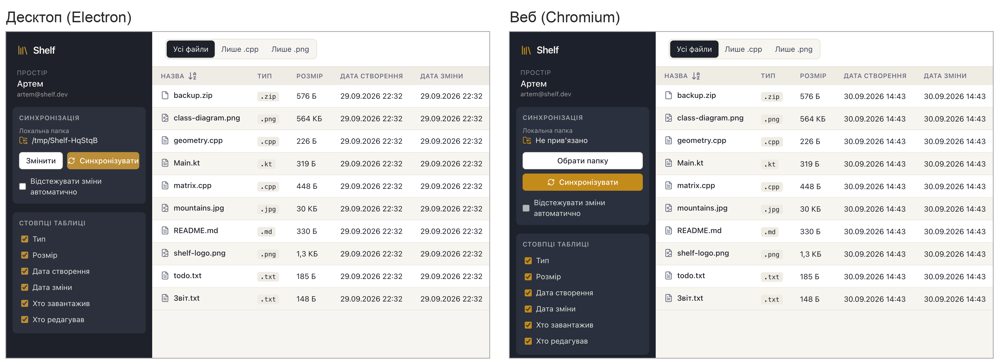
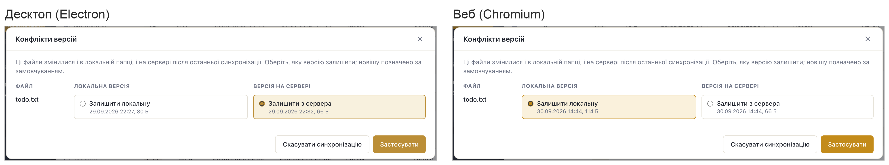
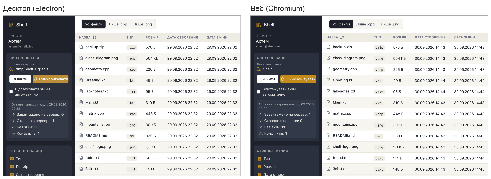

```{=latex}
\makeatletter
\let\ShelfTexttt\texttt
\renewcommand{\texttt}[1]{{\ShelfTexttt{\hyphenchar\font=-1\fontdimen3\font=0pt\fontdimen4\font=0pt\relax #1}}}
\makeatother
\setlength{\emergencystretch}{5em}
\hyphenation{
  AuthForm BrowserLocalFolder Chromium ConflictDialog DevTools Electron FileApiClient
  FileListController FileTableView FolderBindingStore FolderWatcher IndexedDB
  IndexedDbSnapshotStore JsonSnapshotStore LocalFolder NodeLocalFolder Playwright
  PreviewDialog Render SettingsStore ShelfBridge ShelfTexttt SnapshotStore SyncEngine
  SyncPanel SyncReportView SyncService Vercel WebSyncService WorkspaceLayout
  computeStatus contextIsolation createPreview encodedDataLength filterByType
  getVisibleFiles isSafeFileName listFiles localStorage previewKindOf sortByName
  splitBySize toggleColumn useFileListController showDirectoryPicker}
\renewcommand{\topfraction}{0.9}
\renewcommand{\bottomfraction}{0.9}
\renewcommand{\textfraction}{0.07}
\captionsetup{skip=6pt}
\widowpenalty=10000
\clubpenalty=10000
\makeatletter
\newcommand{\ShelfNeedspace}[1]{\par\begingroup\setlength{\dimen@}{#1}%
  \vskip\z@\@plus\dimen@\penalty-100\vskip\z@\@plus-\dimen@
  \vskip\dimen@\penalty9999\vskip-\dimen@\vskip\z@skip\endgroup}
% figures still waiting for a place go to the top of the next pages, before the text that follows
\newcount\ShelfBarrierPass
\newcommand{\ShelfFloatBarrier}{\par\global\ShelfBarrierPass=0 \ShelfFloatBarrierPass}
\newcommand{\ShelfFloatBarrierPass}{\ifx\@deferlist\@empty\else
  \global\advance\ShelfBarrierPass by 1
  \ifnum\ShelfBarrierPass>3 \clearpage\else\newpage\expandafter\ShelfFloatBarrierPass\fi\fi}
\makeatother
```


# Постановка задачі

Четвертий етап лабораторної роботи присвячено порівнянню двох клієнтів системи
Shelf, створених на попередніх етапах: десктопного застосунку на Electron (етап 2)
і веб-клієнта на Next.js (етап 3). Обидва клієнти реалізують ту саму UML-модель
етапу 1 і працюють з одним сервером через його REST API, тож користувач бачить у них
той самий простір із файлами, ті самі операції варіанта 8-6 (сортування за назвою,
фільтр «усі файли / лише `.cpp` / лише `.png`», перегляд `.kt` як тексту і `.jpg` як
зображення) і ту саму синхронізацію з локальною папкою.

Клієнти порівнюються за такими критеріями: технологія і середовище виконання; як
користувач отримує застосунок і його оновлення; підтримувані платформи; доступ до
локальних файлів і відстеження змін у папці; де зберігається стан синхронізації;
модель безпеки; розмір артефакту, час запуску і тривалість першої синхронізації
(ці три показники виміряно); тестування.

Адреси проєкту:

- сайт: <https://shelf-opal-two.vercel.app>;
- REST API: <https://shelf-api-l989.onrender.com>, документація за шляхом `/api/docs`;
- вихідний код: <https://github.com/NONAME-lf/shelf>.

## Умови вимірювань

Усі числа в звіті отримано 30.09.2026 на одному комп'ютері: Apple M2 Max, 32 ГБ
оперативної пам'яті, macOS 26.6.2, Node.js 24.11.1, Playwright 1.63 з Chromium 153 і
Electron 39.8.10. Кожен час у звіті є медіаною трьох запусків. Розміри подано так
само, як у таблиці файлів самого клієнта: 1 КБ = 1024 Б, 1 МБ = 1024 КБ. На іншому
комп'ютері чи з іншим підключенням до інтернету значення будуть іншими, тому варто
дивитися передусім на співвідношення між клієнтами.

Повторити вимірювання можна скриптом `tools/compare-clients.mjs`, який друкує
значення кожного запуску і медіану. Командам `artefacts`, `startup` і `sync`
потрібні зібрані клієнти, а `sync` ще й запущений локальний стек:

```bash
pnpm -F @shelf/shared build && pnpm -F @shelf/desktop dist:mac
pnpm -F @shelf/web build                  # веб-клієнт для локального API
node tools/compare-clients.mjs loc        # і artefacts, web-load, startup
node tools/compare-clients.mjs sync       # потрібен запущений pnpm stack:up
```

```{=latex}
\ShelfNeedspace{6cm}
\begingroup\footnotesize
```

| Показник | Спосіб вимірювання | Команда |
|:----------------|:----------------------------------------------------------------|:-----------|
| частка спільного коду | рядки файлів `.ts` і `.tsx` зі списку `git ls-files` у каталогах `src`, пораховані так само, як це робить утиліта `wc`; тести й тестові допоміжні файли окремо | `loc` |
| розмір десктопного артефакту | розмір `.dmg` і сума розмірів файлів `Shelf.app`, щойно зібраних з поточного коду | `artefacts` |
| обсяг першого завантаження сайту | Chromium з порожнім профілем і вимкненим кешем; сума `encodedDataLength` усіх відповідей за протоколом DevTools, тобто передані байти разом із заголовками | `web-load` |
| запуск десктопа | від старту зібраного `Shelf.app` через Playwright `_electron` (помічник `apps/desktop/scripts/lib/app.mjs`) до видимої кнопки входу; щоразу новий профіль | `startup` |
| запуск веба | від переходу на `/login` опублікованого сайту в уже запущеному Chromium з порожнім профілем до видимої кнопки входу; сервер попередньо розбуджено запитами `/api/health` | `startup` |
| перша синхронізація | локальний стек; новий обліковий запис із 10 демонстраційними файлами (597 КБ); від натискання «Синхронізувати» до рядка «Скачано з сервера: 10»; щоразу порожня папка: тимчасовий каталог у десктопі, каталог OPFS у вебі | `sync` |

```{=latex}
\endgroup
```

# Спільна основа

Проєкт є монорепозиторієм pnpm: сервер `apps/api`, клієнти `apps/desktop` і
`apps/web` та два спільні пакети. Пакет `@shelf/shared` не залежить ні від React, ні
від Electron чи браузера. У ньому типи й DTO (їх використовує і сервер), операції
варіанта `sortByName`, `filterByType` і `getVisibleFiles`, `toggleColumn`, вибір
способу перегляду `previewKindOf` і `createPreview`, REST-клієнт `FileApiClient`,
перевірка ліміту `splitBySize` і вся логіка синхронізації: `computeStatus`,
побудова плану і `SyncEngine` з інтерфейсами `LocalFolder` і `SnapshotStore`. Пакет
`@shelf/ui` містить React-компоненти всіх екранів, від `AuthForm` і
`WorkspaceLayout` до `FileTableView`, `PreviewDialog`, `SyncPanel` і
`ConflictDialog`, а також хук `useFileListController`, яким реалізовано керівний
клас `FileListController` з VOPC-діаграми. Клієнт лише складає з цих частин свої
екрани і реалізує інтерфейси для своєї платформи.

```{=latex}
\ShelfNeedspace{5cm}
\begingroup\small
```

| Пакет | Файлів коду | Рядків коду | Файлів тестів | Рядків тестів |
|:-------------------------|-----------:|-----------:|-----------:|-----------:|
| `@shelf/shared` | 15 | 866 | 13 | 1127 |
| `@shelf/ui` | 18 | 1152 | 1 | 17 |
| `@shelf/desktop` | 19 | 1184 | 8 | 623 |
| `@shelf/web` | 22 | 1341 | 9 | 1129 |
| `@shelf/api` (для довідки) | 29 | 839 | 8 | 599 |

```{=latex}
\endgroup
```

Разом зі спільними пакетами десктопний клієнт має 3202 рядки коду: 2018 спільних
(63,0 %) і 1184 власних (37,0 %). У веб-клієнті 3359 рядків, з них ті самі 2018 спільних (60,1 %) і 1341 власний (39,9 %). Більшість власного коду обох клієнтів
припадає на роботу з локальною папкою. У десктопі це 623 рядки: модулі
main-процесу, крім `index.ts` (створення вікна) і `fileTransfers.ts` (збереження
файлів), тобто `NodeLocalFolder`, `FolderWatcher`, `SyncService`,
`JsonSnapshotStore`, `SettingsStore` і обробники IPC, разом із хуком
`useDesktopSync`. У вебі це каталог `sync/` разом із хуком `useWebSync`, 855 рядків:
`BrowserLocalFolder`, сховища в IndexedDB і `WebSyncService` з опитуванням папки.
Різниця у 232 рядки припадає переважно на запити дозволу на папку, сховища в
IndexedDB і переклад помилок браузера. Ці рядки пораховано так само, як у таблиці.
До тестових файлів зараховано й допоміжні: фіктивний API і файлову систему в
пам'яті.

Операції варіанта поводяться в обох клієнтах однаково не через старанне
дублювання, а тому, що це одна й та сама функція. Екран кожного клієнта викликає
`useFileListController` з `@shelf/ui`, а той обчислює видимі рядки як
`getVisibleFiles(files, direction, filter)`, тобто
`filterByType(sortByName(files, direction), filter)` з `@shelf/shared`; клієнт лише
передає список файлів, отриманий від `FileApiClient`. Так само спільні
`toggleColumn` і `previewKindOf`. Тести цих функцій (17 для розширень, сортування й
фільтра, 15 для перегляду, 3 для стовпців) лежать у `@shelf/shared` і перевіряють
саме той код, який потрапляє в обидві збірки, а наскрізні перевірки обох клієнтів
однаково вмикають спадання з «Лише .cpp» і очікують `matrix.cpp` перед
`geometry.cpp`. Від середовища залежить тільки мова порівняння в `Intl.Collator`: її
задає Electron або браузер, тому порядок кириличних і латинських назв визначає мова
системи в десктопі і мова браузера у вебі.

# Порівняння за критеріями

Таблиця зводить відмінності клієнтів; виміряні значення отримано способами,
описаними в підрозділі 1.1.

```{=latex}
\begingroup\footnotesize\renewcommand{\arraystretch}{1.12}
```

| Критерій | Десктоп (етап 2) | Веб (етап 3) |
|:------------------|:-----------------------------------------------|:-----------------------------------------------|
| технологія | Electron 39 (Chromium і Node.js), React 19, збірка electron-vite; процеси main, preload і renderer | Next.js 16 з App Router, React 19; усі сторінки статичні, код виконує браузер |
| як отримати | непідписаний `.dmg`; скачаний з інтернету застосунок macOS спочатку блокує, і перший запуск треба дозволити в «Системні параметри → Конфіденційність і безпека → Усе одно відкрити» | адреса сайту, встановлення не потрібне |
| оновлення | нова збірка `dist:mac` і повторне встановлення; перевірки нових версій немає | Vercel сам збирає і публікує сайт після `push` у гілку `main`; нову версію користувач отримує під час наступного відкриття |
| платформи | зібрано для macOS (arm64); Windows (`dist:win`, NSIS) і Linux (AppImage) описано в `electron-builder.yml` | будь-який сучасний браузер, зокрема на телефоні; синхронізація з папкою лише в настільних Chrome і Edge |
| екран | окреме вікно, щонайменше 1024 × 640 | вкладка браузера; вужче 768 px бічна панель ховається за кнопкою меню |
| доступ до файлів | Node `fs` у main-процесі; будь-яка папка із системного діалогу, відомий повний шлях | File System Access API: дескриптор (`handle`) папки без шляху, дозвіл користувача; після перезавантаження сторінки за замовчуванням дозвіл треба підтвердити знову |
| відстеження змін | події файлової системи (`chokidar`), запуск через 1,5 с після останньої зміни | опитування списку файлів кожні 5 с, лише поки вкладка видима |
| час зміни скачаного файлу | `utimes` задає час серверної версії | задати неможливо: файл має поточний час, і саме його записано у знімок |
| знімок і налаштування | JSON-файли в `userData`: `settings.json` і `snapshots/<sha1 шляху>.json` | IndexedDB: `IndexedDbSnapshotStore` і `FolderBindingStore` |
| скачування | системний діалог збереження файлу і перетягування рядка у Finder | `Blob` і `<a download>`, файл потрапляє до теки завантажень браузера |
| перетягування | в обидва боки: файли у вікно і рядок із вікна | лише файли на сторінку |
| безпека | `contextIsolation`, `sandbox`, типізований міст `window.shelf` у preload, CSP, заборона навігації вікна | пісочниця браузера, доступ лише до обраної папки, CORS на сервері |
| адреса API | поле «Адреса сервера» на екрані входу, зберігається в `settings.json` | змінна `NEXT_PUBLIC_API_URL`, вбудована під час збірки |
| запуск без мережі | вікно відкривається, збережена сесія не скидається, але список файлів і синхронізація недоступні | опублікована сторінка не відкривається (service worker немає) |
| розмір артефакту | `.dmg` 104,8 МБ; `Shelf.app` 255,3 МБ, з них Electron Framework 252,6 МБ, а код застосунку разом із залежностями (`app.asar`) 1,1 МБ | перше відкриття `/login` 163,4 КБ (11 запитів), `/workspace` 171,4 КБ (15 запитів, разом із відповідями API) |
| запуск до форми входу | 469 мс; перший запуск після збірки 2,3 с (один запуск) | 363 мс з порожнім кешем, 110 мс з кешем (без запуску браузера) |
| перша синхронізація 10 файлів | 216 мс | 202 мс (папка OPFS) |
| unit-тести | Vitest, 7 файлів, 42 тести: `NodeLocalFolder`, `FolderWatcher`, `SyncService` | Vitest, 7 файлів, 56 тестів: `BrowserLocalFolder`, IndexedDB, `WebSyncService` |
| наскрізні перевірки | Playwright `_electron`: `smoke.mjs` на 12 кроків і `check-packaged.mjs` для зібраного `Shelf.app` | Playwright з Chromium, 20 кроків, папка в OPFS; пройдено і на опублікованій системі |

```{=latex}
\endgroup
```

Спільні 142 тести `@shelf/shared` і 2 тести `@shelf/ui` перевіряють код обох
клієнтів одночасно; разом із тестами клієнтів і 58 тестами сервера `pnpm test`
виконує 300 тестів, і всі вони проходять.

## Доступ до файлів і відстеження змін

Найбільша відмінність клієнтів полягає в доступі до локальної папки. Main-процес
десктопа має Node `fs`: він працює з будь-якою папкою, яку користувач обрав у
системному діалозі, знає її повний шлях і записує скачаний файл через тимчасовий
`.shelf-*.part`, `utimes` і перейменування. Файл отримує час зміни серверної
версії, тож наступне порівняння одразу бачить його незміненим. `FolderWatcher`
отримує від системи події про зміни, чекає, доки запис завершиться, і запускає
синхронізацію через 1,5 с після останньої зміни, навіть коли вікно згорнуте.

Сторінка в браузері отримує лише дескриптор обраної папки без шляху, а доступ до
неї дає користувач. Дескриптор сторінка зберігає в IndexedDB, тож після
перезавантаження папка лишається прив'язаною, але за замовчуванням дозвіл треба
підтвердити знову, і попросити його сторінка може тільки у відповідь на клік, тому
автоматичні запуски чекають. Змінити час файлу браузер не дозволяє, отже
`SyncEngine` записує у знімок час, який повернув `LocalFolder.write`, інакше
скачаний файл виглядав би зміненим локально. Подій про зміни в папці браузер не
надсилає, тож `WebSyncService` перечитує її вміст кожні 5 с, і зміна потрапляє на
сервер із затримкою до 5 с. Поки вкладка прихована, зміни на сервер не потрапляють
зовсім: їх помітить перше опитування після повернення до вкладки, а в закритій
вкладці відстеження немає.

## Доставка й оновлення

Щоб отримати десктоп, користувач скачує `.dmg` на 104,8 МБ і переносить Shelf до
теки «Програми». Збірку не підписано сертифікатом Apple, тому скачаний з інтернету
застосунок macOS спочатку блокує, і перший запуск треба дозволити в «Системні
параметри → Конфіденційність і безпека → Усе одно відкрити»; `.dmg`, зібраний на
тому самому комп'ютері, відкривається без цього запиту. Оновити застосунок можна
тільки новою збіркою, бо перевірки версій у ньому немає. Натомість встановлена
програма не залежить від хостингу сайту, а сервер для неї можна змінити просто на
екрані входу: локальний стек чи опублікований API.

Для веба нічого встановлювати не треба: перше відкриття сторінки входу передає
163,4 КБ. Після `push` у гілку `main` Vercel сам збирає й публікує нову версію, і
всі користувачі отримують її під час наступного відкриття сторінки. Ціна цього
полягає в залежності від Vercel і Render: безкоштовний сервер Render засинає після
15 хвилин без запитів, а адресу API вбудовано в збірку, тож інший сервер потребує
іншої збірки.

## Безпека

У десктопі інтерфейс працює в renderer-процесі з `contextIsolation` і `sandbox`,
без доступу до Node. До файлів і системних діалогів він звертається лише через 13 методів моста `window.shelf`, описаних типом `ShelfBridge`, а назви файлів
перевіряє `isSafeFileName`. CSP у `index.html` дозволяє скрипти тільки із самого
застосунку, вікно не може перейти на іншу адресу, а зовнішні посилання
відкриваються в системному браузері. Проте сам застосунок має всі права
користувача, і непідписаній збірці доводиться просто довіряти.

Сторінку веб-клієнта обмежує пісочниця браузера: вона бачить лише обрану
користувачем папку, а дозвіл прив'язано до походження сайту. API розташовано на
іншому домені, і відповіді сторінка читає з дозволу CORS; сервер приймає будь-яке
походження, бо сесію передає токен у заголовку `Authorization`, а не cookie. В обох
клієнтах JWT лежить у `localStorage`, тож вразливість XSS дала б змогу його
викрасти; ризик зменшують екранування React і відсутність сторонніх скриптів, а в
десктопі ще й CSP, якої веб-клієнт не задає.

## Розмір, запуск і синхронізація

Образ `.dmg` приблизно в 657 разів більший за перше завантаження сторінки входу,
але самого застосунку в ньому небагато: зі 255,3 МБ `Shelf.app` 252,6 МБ займає
Electron Framework (Chromium і Node.js), а код застосунку разом із залежностями
(`app.asar`) лише 1,1 МБ. Веб-клієнт використовує вже встановлений браузер: для
`/login` сайт передає 155,4 КБ скриптів (494,0 КБ після розпакування), а перехід
після входу на `/workspace` додає ще 11,5 КБ разом із відповідями API. Таблиці
First Load JS `next build` у Next.js 16 уже не друкує, але той самий обсяг видно у
файлі `.next/diagnostics/route-bundle-stats.json` локальної збірки: для `/login`
9 фрагментів, 493,6 КБ JS без стиснення.

Від старту зібраного застосунку до форми входу минає 469 мс (запуски 2304, 469 і
420 мс). Перший запуск одразу після збірки тривав 2,3 с; причину окремо не
досліджували. Наступні запуски тривали менше 0,6 с, а повторна серія дала 431, 527 і 436 мс (медіана 436 мс). Сторінка входу опублікованого сайту з порожнім кешем
з'являється за 363 мс (377, 363 і 352 мс), а з кешем за 110 мс; повторна серія дала
398 і 105 мс. Час веба не містить запуску браузера, а час десктопа містить старт
процесів Electron і під'єднання до них Playwright, тому за цими медіанами для
користувача з уже відкритим браузером сайт відкривається не повільніше за
застосунок. Проте час запуску помітно коливається між запусками: контрольний
запуск після всіх виправлень дав 898 мс для десктопа і 3495 мс для веба з
порожнім кешем (135 мс з кешем), а причину окремо не досліджували. Тому ці
значення показують порядок величин, а не точне співвідношення клієнтів.

Перша синхронізація 10 демонстраційних файлів із локального стека в порожню папку
триває 216 мс у десктопі (224, 215 і 216 мс) і 202 мс у вебі (200, 202 і 202 мс).
Різниця становить 14 мс (близько 7 %); час запитів до сервера і час запису файлів
окремо не вимірювали. Веб вимірювано з каталогом OPFS: системний діалог вибору
папки Playwright відкрити не може. У справжній папці Chrome записує файл через
тимчасовий `.crswap` і може перевіряти його перед заміною, тому там час може бути
більшим; окремо це не вимірювалося.

# Однакові сценарії у двох клієнтах

Нижче поруч розміщено фрагменти знімків з етапів 2 і 3 (ліворуч десктоп, праворуч
веб), зроблених у вікні шириною 1280 px зі свіжими демонстраційними даними, тому
дати в таблицях різні. Рис. 1 і 3 показують ліву верхню частину вікна, рис. 2 показує варіанти вибору в діалозі конфліктів.

{width=15.5cm}

На рис. 1 збігаються компоновка, бічна панель, фільтр, стовпці, назви, типи й
розміри файлів: обидва екрани складено з тих самих компонентів `WorkspaceLayout`,
`TypeFilterControl`, `FileTableView` і `ColumnPicker`. Різниться тільки блок
синхронізації. Десктопу папку прив'язано заздалегідь, і він показує її повний шлях
`/tmp/Shelf-HqStqB` та кнопку «Змінити». У вебі папку ще не обрано, тож видно «Не
прив'язано» і кнопку «Обрати папку»; після вибору там з'явиться лише назва папки,
бо шляху сторінка не знає.

{width=16.5cm}

Діалог `ConflictDialog` в обох клієнтах однаковий: заголовок, пояснення, стовпці
«Локальна версія» і «Версія на сервері» з часом і розміром кожної, кнопки
«Скасувати синхронізацію» і «Застосувати»; рис. 2 показує його середню частину.
Заздалегідь вибрано новішу версію за тим самим правилом із `@shelf/shared`. У
сценарії етапу 2 новішою була серверна версія `todo.txt` (22:32, 66 Б проти
локальної 22:27, 80 Б), а в сценарії етапу 3 локальний файл змінили вже після
серверного (обидва о 14:44; 114 Б проти 66 Б), тому позначки стоять у різних
стовпцях.

Рис. 3 показує результат «Застосувати». Звіт `SyncReportView` має ті самі чотири
рядки, а «Без змін: 11» і «Конфліктів: 1» збігаються, бо обидва сценарії мали
12 файлів з одним конфліктом, а план склав той самий `SyncEngine`. Відрізняється
напрямок: десктоп залишив версію з сервера («Скачано з сервера: 1», `todo.txt` має
66 Б), а веб локальну («Завантажено на сервер: 1», `todo.txt` має 114 Б і новий час
зміни). Запис папки в бічній панелі знову різний: повний шлях у десктопі і лише
назва `Shelf` у вебі. Спільний рушій отримав від кожного клієнта тільки інші
`LocalFolder` і `SnapshotStore`.

{width=15.5cm}

```{=latex}
\ShelfFloatBarrier
\ShelfNeedspace{7cm}
```

# Переваги й обмеження

## Десктопний клієнт

```{=latex}
\ShelfNeedspace{3.5cm}
```

**Переваги:**

- працює з будь-якою папкою без повторних дозволів і реагує на зміни в ній
  подіями файлової системи, навіть коли вікно згорнуте;
- скачані файли мають час зміни серверної версії;
- файл можна скачати через системний діалог збереження файлу або перетягнути
  рядок у Finder;
- адресу сервера можна змінити на екрані входу, а без мережі вікно все одно
  відкривається.

```{=latex}
\ShelfNeedspace{3.5cm}
```

**Обмеження:**

- треба скачати 104,8 МБ, встановити непідписаний застосунок і дозволити його
  перший запуск у налаштуваннях macOS;
- кожне оновлення вимагає нової збірки і повторного встановлення;
- на диску займає 255,3 МБ, з яких код застосунку разом із залежностями
  (`app.asar`) лише 1,1 МБ;
- зібрано й перевірено тільки версію для macOS.

```{=latex}
\ShelfNeedspace{5cm}
```

## Веб-клієнт

```{=latex}
\ShelfNeedspace{3.5cm}
```

**Переваги:**

- нічого не треба встановлювати: перше відкриття передає 163,4 КБ і показує форму
  входу за 363 мс;
- нову версію всі отримують під час наступного відкриття сторінки;
- працює на будь-якому пристрої з сучасним браузером, зокрема на телефоні;
- пісочниця браузера пускає сторінку лише до папки, яку дозволив користувач.

```{=latex}
\ShelfNeedspace{3.5cm}
```

**Обмеження:**

- синхронізація з папкою працює лише в настільних Chrome і Edge, а дозвіл після
  перезавантаження сторінки за замовчуванням треба підтвердити знову;
- зміни в папці помічає опитування кожні 5 с і лише у видимій вкладці;
- скачаний файл отримує поточний час, а перетягнути рядок у файловий менеджер
  неможливо;
- без мережі сторінка не відкривається, а адресу API задає збірка.

```{=latex}
\ShelfNeedspace{5cm}
```

## Коли що обрати

Десктоп доречний, коли з локальною папкою працюють постійно й багато: вона може
лежати будь-де, зміни мають потрапляти на сервер одразу, навіть із згорнутим
вікном, а файли зручно перетягувати у Finder. Він же підходить для роботи з
кількома серверами, наприклад з локальним стеком. Веб доречний, коли потрібен
швидкий доступ до файлів без встановлення: з чужого комп'ютера, з телефона чи для
того, щоб переглянути, скачати або завантажити кілька файлів. Для синхронізації у
вебі потрібен настільний Chrome або Edge і відкрита вкладка. Обидва клієнти
працюють з тим самим простором, тому їх можна поєднувати: десктоп синхронізує
робочу папку, а веб дає доступ до тих самих файлів з будь-якого пристрою.

# Висновки

На етапі 4 порівняно десктопний і веб-клієнти Shelf. Обидва реалізують одну
UML-модель і працюють з одним сервером, а спільні пакети становлять 63,0 % коду
десктопа і 60,1 % коду веба, тому операції варіанта, перегляд, REST-клієнт, рушій
синхронізації й усі компоненти екранів у них спільні. Відмінності зосереджено там,
де платформа дає різні можливості. Десктоп має повний доступ до папки, події змін і
збереження часу файлу, але поширюється як `.dmg` на 104,8 МБ і оновлюється
перевстановленням. Веб не потребує встановлення: форма входу з'являється за 363 мс
після передачі 163,4 КБ, а нові версії публікуються автоматично; проте папку він
синхронізує лише в настільних Chrome і Edge, опитуючи її кожні 5 с. Перша
синхронізація 10 файлів триває майже однаково: 216 і 202 мс. Отже, десктоп краще
підходить для постійної роботи з локальною папкою, а веб — для швидкого доступу до
файлів з будь-якого пристрою.
